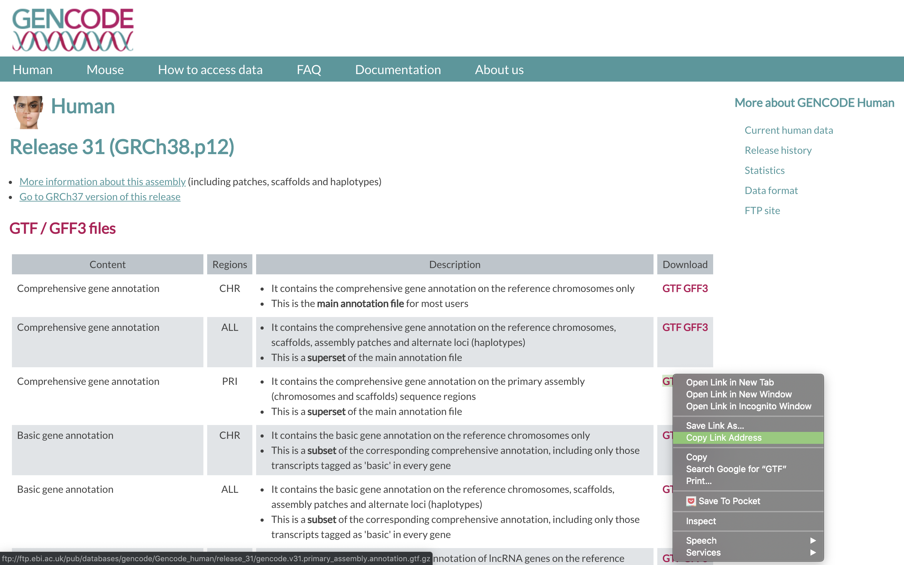
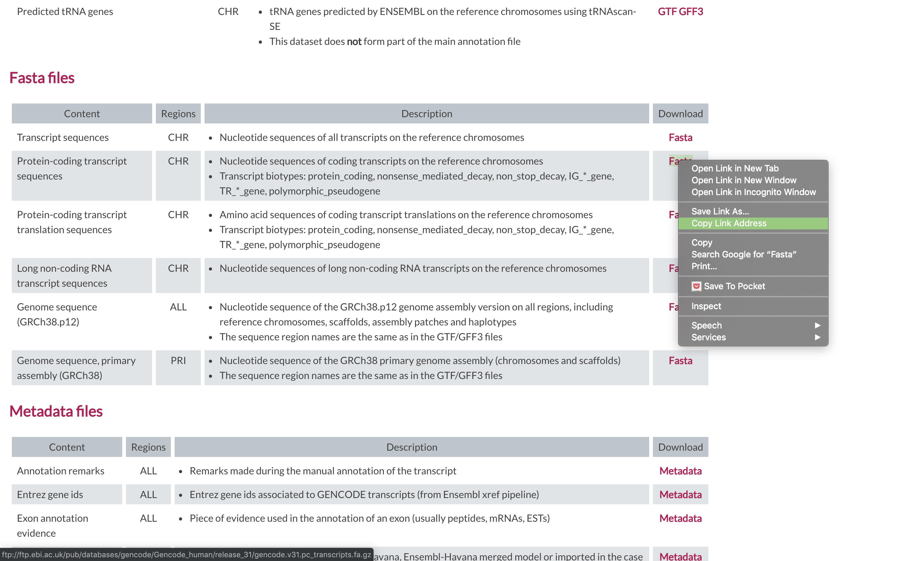

# Alignment using Salmon

## Salmon Aligner
[Salmon](https://salmon.readthedocs.io/en/latest/salmon.html) is a tool for quantifying the expression of transcripts using RNA-seq data. Salmon uses new algorithms (specifically, coupling the concept of quasi-mapping with a two-phase inference procedure) to provide accurate expression estimates very quickly (i.e. wicked-fast) and while using little memory. Salmon performs its inference using an expressive and realistic model of RNA-seq data that takes into account experimental attributes and biases commonly observed in real RNA-seq data.

## We first need to index the reference (In this case the transcriptome)

**1\.** First lets make sure we are where we are supposed to be and that the References directory is available.

    cd /share/workshop/$USER/rnaseq_example

---
**2\.** To align our data we will need the transcriptome (fasta) and annotation (gtf) for human. There are many places to find them, but we are going to get it from the [GENCODE](https://www.gencodegenes.org/human/).

We need to first get the urls for the and protein coding genes. For RNAseq we want to use the protein coding transcript sequences and basic gene annotation. At the time of this workshop the current version of GENCODE is *31*. You will want to update the scripts to use the current version.

-----
**3\.** Lets take a look at the help docs for salmon and its subcommands as well:

	module load salmon
	salamon -h
	salmon index -h

-----
**4\.** First we need to index the transcriptome for STAR. Lets pull down a slurm script to index the human GENCODE version of the transcriptome.

	wget https://raw.githubusercontent.com/ucdavis-bioinformatics-training/2019_August_UCD_mRNAseq_Workshop/master/scripts/salmon_index.slurm
	less salmon_index.slurm

Press 'q' to exit.

#!/bin/bash

#SBATCH --job-name=salmon_index # Job name
#SBATCH --nodes=1
#SBATCH --ntasks=8
#SBATCH --time=60
#SBATCH --mem=15000 # Memory pool for all cores (see also --mem-per-cpu)
#SBATCH --partition=production
#SBATCH --reservation=workshop
#SBATCH --account=workshop
#SBATCH --output=slurmout/salmon-index_%A.out # File to which STDOUT will be written
#SBATCH --error=slurmout/salmon-index_%A.err # File to which STDERR will be written

start=`date +%s`
echo $HOSTNAME

outpath="References"

cd ${outpath}
wget ftp://ftp.ebi.ac.uk/pub/databases/gencode/Gencode_human/release_31/gencode.v31.pc_transcripts.fa.gz
gunzip gencode.v31.pc_transcripts.fa.gz
PC_FASTA="gencode.v31.pc_transcripts.fa"
INDEX="salmon_gencode.v31.index"

module load salmon
call="salmon index -i ${INDEX} -k 31 --gencode -p 8 -t ${PC_FASTA}"
echo $call
eval $call

end=`date +%s`
runtime=$((end-start))
echo $runtime

1. The script changes into the References directory.
1. It uses wget to download the transcript fasta file from GENCODE.
1. Uncompresses it using gunzip.
1. Run Salmon indexing, using the "gencode" flag to parse the GENCODE file properly, and outputting to a new directory called "salmon_gencode.v31.index".

Run salmon indexing when ready.

	sbatch salmon_index.slurm

This step does not take long, about 15 minutes. You can look at the [salmon documentation](https://salmon.readthedocs.io/en/latest/salmon.html) while you wait. All of the output files will be written to the salmon_gencode.v31.index directory.

**IF** for some reason it didn't finish, is corrupted, or you missed the session, you can copy over a completed copy.

	cp -r /share/biocore/workshops/2019_August_RNAseq/References/salmon_gencode.v31.index /share/workshop/$USER/rnaseq_example/References/

## Alignments

**1\.** We are now ready to try an alignment:

    cd /share/workshop/$USER/rnaseq_example/HTS_testing

Then run the salmon quant (quantify transcripts) command

    module load salmon
		salmon quant --help-reads

    salmon quant \
    --threads 8 \
    --index ../References/salmon_gencode.v31.index \
		--libType A \
		--validateMappings \
		--geneMap ../References/gencode.v31.primary_assembly.annotation.gtf \
		--output SampleAC1.salmon \
    -1 SampleAC1.streamed_R1.fastq.gz \
		-2 SampleAC1.streamed_R2.fastq.gz

In the command, we are telling salmon to quantify reads with libtype 'auto' ([libtype](https://salmon.readthedocs.io/en/latest/salmon.html#what-s-this-libtype)) on a gene level ('--geneMap'), the folder for all the output files will be SampleAC1.salmon, and finally, the input file pair.

## Running Salmon on the experiment

**1\.** We can now run Salmon across all samples on the real data using a SLURM script, [salmon.slurm](../scripts/salmon.slurm), that we should take a look at now.

    cd /share/workshop/$USER/rnaseq_example  # We'll run this from the main directory
    wget https://raw.githubusercontent.com/ucdavis-bioinformatics-training/2019_August_UCD_mRNAseq_Workshop/master/scripts/salmon.slurm
    less salmon.slurm

 When you are done, type "q" to exit.

	cd /share/workshop/$USER/rnaseq_example
	wget https://raw.githubusercontent.com/ucdavis-bioinformatics-training/2019_August_UCD_mRNAseq_Workshop/master/scripts/salmon.slurm
	less salmon.slurm

Press 'q' to exit.

#!/bin/bash
#SBATCH --array=1-16  # NEED TO CHANGE THIS!
#SBATCH --job-name=star # Job name
#SBATCH --nodes=1
#SBATCH --ntasks=8
#SBATCH --time=1440
#SBATCH --mem=20000 # Memory pool for all cores (see also --mem-per-cpu)
#SBATCH --partition=production
#SBATCH --reservation=workshop
#SBATCH --account=workshop
#SBATCH --output=slurmout/star_%A_%a.out # File to which STDOUT will be written
#SBATCH --error=slurmout/star_%A_%a.err # File to which STDERR will be written

start=`date +%s`
hostname

outdir="02-Salmon"
sampfile="samples.txt"
REF="References/salmon_index"
GTF="References/gencodev31.primary_assembly.annotation.gtf"

SAMPLE=`head -n ${SLURM_ARRAY_TASK_ID} $sampfile | tail -1`
R1="01-HTS_Preproc/$SAMPLE/${SAMPLE}_R1.fastq.gz"
R2="01-HTS_Preproc/$SAMPLE/${SAMPLE}_R2.fastq.gz"

echo $SAMPLE

if [ ! -e $outdir ]; then
    mkdir $outdir
fi

module load salmon
call="salmon quant -p 8 -i $REF -l A \
--validateMappings -g $GTF \
-1 $R1 -2 $R2 \
-o $outdir/$SAMPLE"

echo $call
eval $call

end=`date +%s`
runtime=$((end-start))
echo Runtime: $runtime seconds

1. The script specifies the output directory (02-Salmon), the samples file (samples.txt), the reference that we just indexed, and the annotation that we downloaded when we ran STAR.
1. It then defines the filenames for the forward and reverse reads (R1 and R2).
1. Creates the output directory.
1. Loads the salmon module and then runs salmon in "quant" mode to quantify (i.e. count) the reads aligning to transcripts. Salmon uses the annotation GTF file to roll up the transcript counts into gene-level counts.

-----

**6\.** Submit the script:

	sbatch salmon.slurm

This will run a job for every sample... each job should only take around 3 minutes to run.

**IF** for some reason it didn't finish, is corrupted, or you missed the session, you can copy over a completed copy.

	cp -r /share/biocore/workshops/2019_August_RNAseq/02-Salmon /share/workshop/$USER/rnaseq_example/

-----

**7\.** Once the jobs finish, take a look at one of the output files:

	cd 02-Salmon/SampleAC1
	less quant.genes.sf

These are the gene-level counts rolled up from the transcript counts. Take a look at the [Salmon output file format documentation](https://salmon.readthedocs.io/en/latest/file_formats.html#fileformats) to understand each of the columns. Press 'q' to exit. We will be comparing the counts from Salmon to the counts from STAR, to see their differences, if any.
