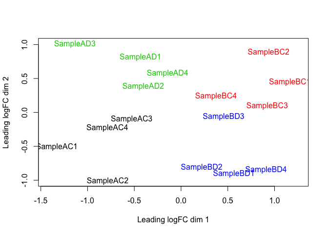
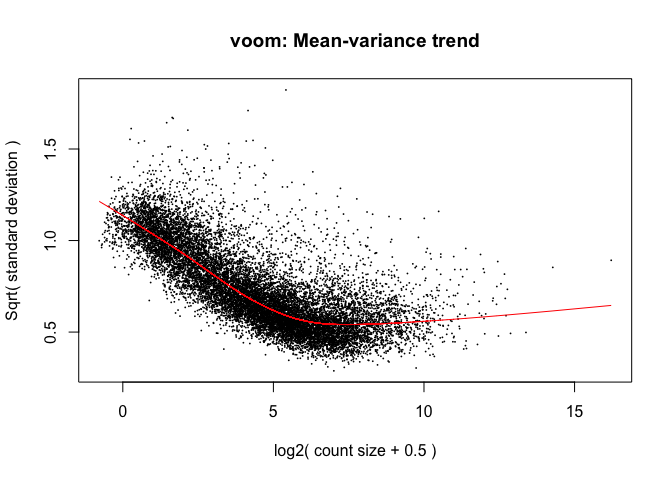
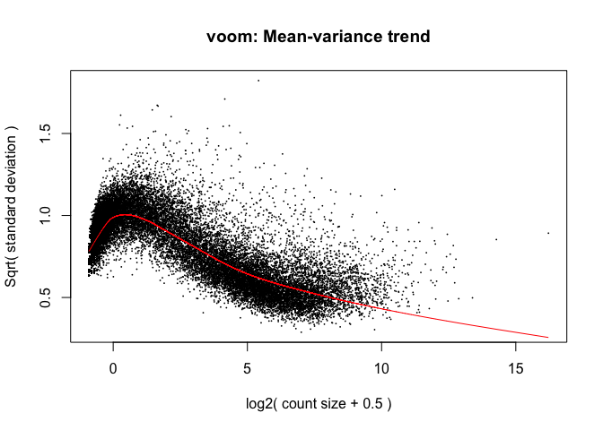
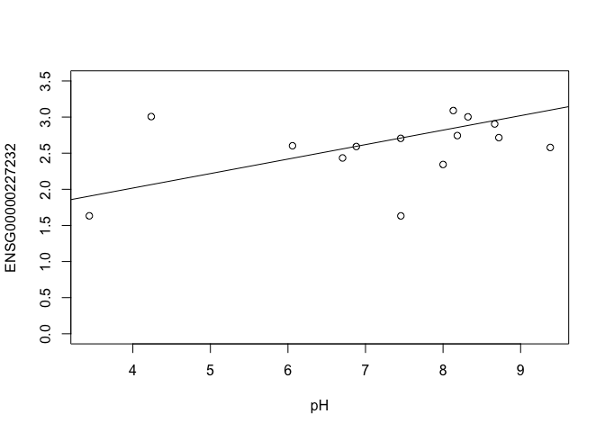
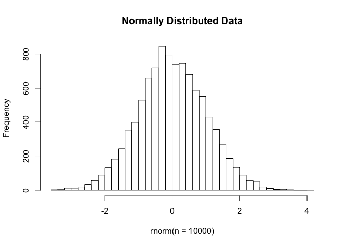
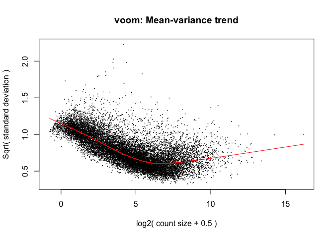
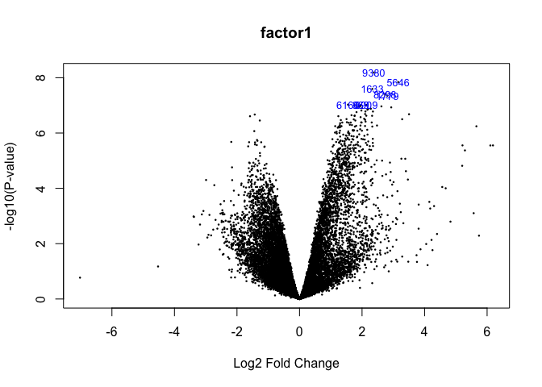
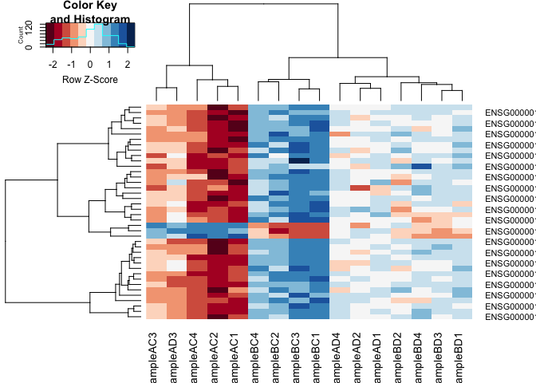
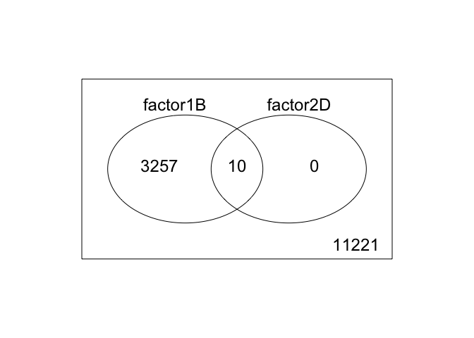

# Differential Gene Expression Analysis in R

* Differential Expression between conditions is determined from count data 
* Generally speaking differential expression analysis is performed in a very similar manner to DNA microarrays, once normalization and transformations have been performed. 
A lot of RNA-seq analysis has been done in R and so there are many packages available to analyze and view this data. Two of the most commonly used are: 
* DESeq2, developed by Simon Anders (also created htseq) in Wolfgang Huber’s group at EMBL
* edgeR and Voom (extension to Limma [microarrays] for RNA-seq), developed out of Gordon Smyth’s group from the Walter and Eliza Hall Institute of Medical Research in Australia
http://bioconductor.org/packages/release/BiocViews.html#___RNASeq

## Differential Expression Analysis with Limma-Voom

limma is an R package that was originally developed for differential expression (DE) analysis of gene expression microarray data.

voom is a function in the limma package that modifies RNA-Seq data for use with limma.

Together they allow fast, flexible, and powerful analyses of RNA-Seq data.  Limma-voom is our tool of choice for DE analyses because it:

* Allows for incredibly flexible model specification (you can include multiple categorical and continuous variables, allowing incorporation of almost any kind of metadata)

* Based on simulation studies, maintains the false discovery rate at or below the nominal rate, unlike some other packages

* Empirical Bayes smoothing of gene-wise standard deviations provides increased power.  

### Basic Steps
1. Read count data into R
2. Filter genes (uninteresting genes, e.g. unexpressed)
3. Calculate normalization factors (sample-specific adjustments)
4. Account for expression-dependent variability by transformation, weighting, or modelling
5. Fit a statistical model 
6. Perform statistical on comparisons of interest (using contrasts)
7. Adjust for multiple testing, Benjamini-Hochberg (BH) or q-value
8. Check results for confidence
9. Attach annotation if available and write tables
10. Plotting, enrichment analysis, interpretation


```r
library(edgeR)
```

```
## Loading required package: limma
```

```r
library("RColorBrewer")
library("gplots")
```

```
## 
## Attaching package: 'gplots'
```

```
## The following object is masked from 'package:stats':
## 
##     lowess
```


**1a./** Read in the counts table and preprocess

```r
counts <- read.delim("rnaseq_workshop_counts.txt", row.names = 1)
dim(counts) # number of genes 
```

```
## [1] 58780    16
```

```r
head(counts)
```

```
##                   SampleAC1 SampleAC2 SampleAC3 SampleAC4 SampleAD1
## ENSG00000223972.5         3         1         0         0         0
## ENSG00000227232.5        20         7        15        10         7
## ENSG00000278267.1         1         2         1         1         0
## ENSG00000243485.5         0         0         0         0         0
## ENSG00000284332.1         0         0         0         0         0
## ENSG00000237613.2         0         0         0         0         0
##                   SampleAD2 SampleAD3 SampleAD4 SampleBC1 SampleBC2
## ENSG00000223972.5         0         0         0         2         0
## ENSG00000227232.5         9        15        26         6        10
## ENSG00000278267.1         1         2         4         0         0
## ENSG00000243485.5         0         0         0         1         0
## ENSG00000284332.1         0         0         0         0         0
## ENSG00000237613.2         0         0         0         0         0
##                   SampleBC3 SampleBC4 SampleBD1 SampleBD2 SampleBD3
## ENSG00000223972.5         0         0         0         5         0
## ENSG00000227232.5         6         6        14        10         4
## ENSG00000278267.1         0         0         0         0         1
## ENSG00000243485.5         0         0         0         0         0
## ENSG00000284332.1         0         0         0         0         0
## ENSG00000237613.2         0         0         0         0         0
##                   SampleBD4
## ENSG00000223972.5         0
## ENSG00000227232.5         4
## ENSG00000278267.1         0
## ENSG00000243485.5         0
## ENSG00000284332.1         0
## ENSG00000237613.2         0
```

Create Differential Gene Expression List Object (DGEList) object

```r
d0 <- DGEList(counts)
```

**1b\.** Read in Annotation

```r
anno <- read.delim("ensembl_hg_95.tsv",as.is=T)
dim(anno)
```

```
## [1] 66832    10
```

```r
head(anno)
```

```
##   Gene.stable.ID.version Gene.name
## 1      ENSG00000210049.1     MT-TF
## 2      ENSG00000211459.2   MT-RNR1
## 3      ENSG00000210077.1     MT-TV
## 4      ENSG00000210082.2   MT-RNR2
## 5      ENSG00000209082.1    MT-TL1
## 6      ENSG00000198888.2    MT-ND1
##                                                                                           Gene.description
## 1                              mitochondrially encoded tRNA-Phe (UUU/C) [Source:HGNC Symbol;Acc:HGNC:7481]
## 2                                      mitochondrially encoded 12S rRNA [Source:HGNC Symbol;Acc:HGNC:7470]
## 3                                mitochondrially encoded tRNA-Val (GUN) [Source:HGNC Symbol;Acc:HGNC:7500]
## 4                                      mitochondrially encoded 16S rRNA [Source:HGNC Symbol;Acc:HGNC:7471]
## 5                            mitochondrially encoded tRNA-Leu (UUA/G) 1 [Source:HGNC Symbol;Acc:HGNC:7490]
## 6 mitochondrially encoded NADH:ubiquinone oxidoreductase core subunit 1 [Source:HGNC Symbol;Acc:HGNC:7455]
##        Gene.type Transcript.count Gene...GC.content
## 1        Mt_tRNA                1             40.85
## 2        Mt_rRNA                1             45.49
## 3        Mt_tRNA                1             42.03
## 4        Mt_rRNA                1             42.81
## 5        Mt_tRNA                1             38.67
## 6 protein_coding                1             47.70
##   Chromosome.scaffold.name Gene.start..bp. Gene.end..bp. Strand
## 1                       MT             577           647      1
## 2                       MT             648          1601      1
## 3                       MT            1602          1670      1
## 4                       MT            1671          3229      1
## 5                       MT            3230          3304      1
## 6                       MT            3307          4262      1
```

```r
tail(anno)
```

```
##       Gene.stable.ID.version  Gene.name
## 66827      ENSG00000285208.1 AP005057.2
## 66828      ENSG00000285430.2 AP005230.2
## 66829     ENSG00000185988.13       PLK5
## 66830      ENSG00000250447.5  LINC02105
## 66831      ENSG00000125304.9     TM9SF2
## 66832      ENSG00000280710.3 AL139035.1
##                                                                      Gene.description
## 66827                                                                novel transcript
## 66828                                                                novel transcript
## 66829                          polo like kinase 5 [Source:HGNC Symbol;Acc:HGNC:27001]
## 66830 long intergenic non-protein coding RNA 2105 [Source:HGNC Symbol;Acc:HGNC:52960]
## 66831        transmembrane 9 superfamily member 2 [Source:HGNC Symbol;Acc:HGNC:11865]
## 66832                                                                novel transcript
##            Gene.type Transcript.count Gene...GC.content
## 66827         lncRNA                1             31.34
## 66828         lncRNA                8             37.73
## 66829 protein_coding                5             60.25
## 66830         lncRNA                2             42.30
## 66831 protein_coding                6             40.68
## 66832         lncRNA                1             46.66
##       Chromosome.scaffold.name Gene.start..bp. Gene.end..bp. Strand
## 66827       CHR_HSCHR18_1_CTG1         1780329       1782064      1
## 66828       CHR_HSCHR18_1_CTG1         1906054       2511956     -1
## 66829                       19         1524074       1536046      1
## 66830                        5        53776644      53819686     -1
## 66831                       13        99446311      99564006      1
## 66832                       13        99498737      99501250      1
```

```r
any(duplicated(anno$Gene.stable.ID))
```

```
## [1] FALSE
```

**2\.** Derive experiment metadata from the sample names

Our experiment has two factors, factor1 ("A" or "B") and factor2 ("C" or "D")

The sample names are "Sample" followed by the factor1, followed by the factor2, followed by the replicate

```r
snames <- colnames(counts) # Sample names
snames
```

```
##  [1] "SampleAC1" "SampleAC2" "SampleAC3" "SampleAC4" "SampleAD1"
##  [6] "SampleAD2" "SampleAD3" "SampleAD4" "SampleBC1" "SampleBC2"
## [11] "SampleBC3" "SampleBC4" "SampleBD1" "SampleBD2" "SampleBD3"
## [16] "SampleBD4"
```

```r
factor1 <- substr(snames, 7, 7) 
factor2 <- substr(snames, 8, 8)
factor1
```

```
##  [1] "A" "A" "A" "A" "A" "A" "A" "A" "B" "B" "B" "B" "B" "B" "B" "B"
```

```r
factor2
```

```
##  [1] "C" "C" "C" "C" "D" "D" "D" "D" "C" "C" "C" "C" "D" "D" "D" "D"
```

Create a new variable "group" that combines factor1 and factor2

```r
group <- interaction(factor1, factor2)
group
```

```
##  [1] A.C A.C A.C A.C A.D A.D A.D A.D B.C B.C B.C B.C B.D B.D B.D B.D
## Levels: A.C B.C A.D B.D
```

Note: you can also enter group information manually, or read it in from an external file.  If you do this, it is $VERY, VERY, VERY$ important that you make sure the metadata is in the same order as the column names of the counts table.


**2\.** Preprocessing

In differential expression analysis, only sample-specific effects need to be normalized, NOT concerned with comparisons and quantification of absolute expression.
* Sequence depth – is a sample specific effect and needs to be adjusted for.
* RNA composition - finding a set of scaling factors for the library sizes that minimize the log-fold changes between the samples for most genes (edgeR uses a trimmed mean of M-values between each pair of sample)
* GC content – is NOT sample-specific (except when it is)
* Gene Length – is NOT sample-specific (except when it is)

In edgeR/limma, you calculate normalization factors to scale the raw library sizes (number of reads) using the function calcNormFactors, which by default uses TMM (weighted trimmed means of M values to the reference). Assumes most genes are not DE.

Proposed by Robinson and Oshlack (2010).


```r
d0 <- calcNormFactors(d0)
d0$samples
```

```
##           group lib.size norm.factors
## SampleAC1     1  2075356    1.2321280
## SampleAC2     1  1047895    1.0898762
## SampleAC3     1  1604854    1.1339792
## SampleAC4     1  1265234    1.1080844
## SampleAD1     1  2276165    1.0632702
## SampleAD2     1  1321273    1.0734832
## SampleAD3     1  2309793    1.2417074
## SampleAD4     1  1673507    1.0610885
## SampleBC1     1  1224130    0.8141137
## SampleBC2     1  1781203    0.9704386
## SampleBC3     1  1301182    0.8281997
## SampleBC4     1  1156635    0.9405136
## SampleBD1     1  1213096    0.8878342
## SampleBD2     1  1407269    0.9282270
## SampleBD3     1  1492204    0.9725616
## SampleBD4     1  1109772    0.7989559
```

Note: calcNormFactors doesn't _normalize_ the data, it just calculates normalization factors for use downstream.

#### Filtering out genes

Common filter is to remove genes with a max value (X) of less then Y.

Another Common filter is to remove genes that are less than X normalized read counts (cpm) across a certain number of samples. Ex: rowSums(cpms <=1) < 3 , require at least 1 cpm in at least 3 samples to keep.

A less used filter is for genes with minimum variance across all samples, so if a gene isn’t changing (constant expression) its inherently not interesting therefor no need to test.

Filter low-expressed genes, remove any row (gene) whose max value (for the row) is less tha cutoff (3).

```r
cutoff <- 3
drop <- which(apply(cpm(d0), 1, max) < cutoff)
d <- d0[-drop,] 
dim(d) # number of genes left
```

```
## [1] 14488    16
```

"Low-expressed" is subjective and depends on the dataset.

Multidimensional scaling (MDS) plot 

```r
plotMDS(d, col = as.numeric(group))
```

<!-- -->

The MDS plot tells you A LOT about what to expect from your experiment.

**3\.** Extracting normalized expression table

### RPKM vs. FPKM vs. CPM and Model Based
* RPKM - Reads per kilobase per million mapped reads 
* FPKM - Fragments per kilobase per million mapped reads
* logCPM – log Counts per million [ good for producing MDS plots, estimate of normalized values in model based ]
* Model based - original read counts are not themselves transformed, but rather correction factors are used in the DE model itself.

We use the cpm function with log=TRUE to obtain log-transformed normalized expression data.  On the log scale, the data has less mean-dependent variability and is more suitable for plotting.

```r
logcpm <- cpm(d, prior.count=2, log=TRUE)
write.table(logcpm,"rnaseq_workshop_normalized_counts.txt",sep="\t",quote=F)
```


**4\.** Voom transformation and calculation of variance weights

Specify the model to be fitted.  We do this before using voom since voom uses variances of the model residuals (observed - fitted)

```r
mm <- model.matrix(~0 + group)
mm
```

```
##    groupA.C groupB.C groupA.D groupB.D
## 1         1        0        0        0
## 2         1        0        0        0
## 3         1        0        0        0
## 4         1        0        0        0
## 5         0        0        1        0
## 6         0        0        1        0
## 7         0        0        1        0
## 8         0        0        1        0
## 9         0        1        0        0
## 10        0        1        0        0
## 11        0        1        0        0
## 12        0        1        0        0
## 13        0        0        0        1
## 14        0        0        0        1
## 15        0        0        0        1
## 16        0        0        0        1
## attr(,"assign")
## [1] 1 1 1 1
## attr(,"contrasts")
## attr(,"contrasts")$group
## [1] "contr.treatment"
```

The above specifies a model where each coefficient corresponds to a group mean.

Voom

```r
y <- voom(d, mm, plot = T)
```

<!-- -->

What is voom doing?

1. Counts are transformed to log2 counts per million reads (CPM), where "per million reads" is defined based on the normalization factors we calculated earlier
2. A linear model is fitted to the log2 CPM for each gene, and the residuals are calculated
3. A smoothed curve is fitted to the sqrt(residual standard deviation) by average expression
(see red line in plot above)
4. The smoothed curve is used to obtain weights for each gene and sample that are passed into limma along with the log2 CPMs.

More details at
https://genomebiology.biomedcentral.com/articles/10.1186/gb-2014-15-2-r29

The above is a "good" voom plot.  If your voom plot looks like the below, you might want to filter more:

```r
tmp <- voom(d0, mm, plot = T)
```

<!-- -->


## Fitting linear models in limma

**1\.** lmFit fits a linear model using weighted least squares for each gene:

```r
fit <- lmFit(y, mm)
head(coef(fit))
```

```
##                     groupA.C   groupB.C  groupA.D    groupB.D
## ENSG00000223972.5 -0.5971262 -0.7600101 -2.043466 -0.32633407
## ENSG00000227232.5  2.9541596  2.6168436  2.581553  2.63969481
## ENSG00000238009.6  0.0426848  1.9985563  1.221692 -0.07446036
## ENSG00000268903.1  5.0252475  6.6584763  5.859706  6.22213002
## ENSG00000269981.1  4.7897120  6.3453121  5.534964  6.18975166
## ENSG00000241860.6  1.7040144  3.1693143  3.037286  2.73262246
```

Comparisons between groups (log fold-changes) are obtained as _contrasts_ of these fitted linear models:

Specify which groups to compare:

Comparison between factor2s C and D for factor1 A

```r
contr <- makeContrasts(groupA.C - groupA.D, levels = colnames(coef(fit)))
contr
```

```
##           Contrasts
## Levels     groupA.C - groupA.D
##   groupA.C                   1
##   groupB.C                   0
##   groupA.D                  -1
##   groupB.D                   0
```

Estimate contrast for each gene

```r
tmp <- contrasts.fit(fit, contr)
```

The variance characteristics of low expressed genes are different from high expressed genes, if treated the same, the effect is to over represent low expressed genes in the DE list.

Empirical Bayes smoothing of standard errors (shrinks standard errors that are much larger or smaller than those from other genes towards the average standard error) (see https://www.degruyter.com/doi/10.2202/1544-6115.1027)


```r
tmp <- eBayes(tmp)
```

What genes are most differentially expressed (show the top 30)?

```r
top.table <- topTable(tmp, sort.by = "P", n = Inf)
head(top.table, 30)
```

```
##                         logFC  AveExpr         t      P.Value   adj.P.Val
## ENSG00000129824.15 -6.0147398 3.826209 -7.151711 7.192005e-07 0.006643531
## ENSG00000067048.16 -6.4034999 2.913309 -6.830168 1.382919e-06 0.006643531
## ENSG00000012817.15 -6.3902747 2.940730 -6.718986 1.739325e-06 0.006643531
## ENSG00000198692.9  -5.1846438 1.887900 -6.693343 1.834216e-06 0.006643531
## ENSG00000099725.14 -5.8261345 2.973758 -6.443233 3.093471e-06 0.008963642
## ENSG00000183878.15 -5.0609574 2.437612 -6.356324 3.716707e-06 0.008974608
## ENSG00000111052.7  -1.6755453 5.558748 -6.134283 5.966643e-06 0.012349247
## ENSG00000114374.12 -5.1961044 1.973817 -5.754669 1.359469e-05 0.022508972
## ENSG00000131002.11 -5.3961967 2.403759 -5.741837 1.398266e-05 0.022508972
## ENSG00000173597.8  -1.3485154 6.533206 -5.420129 2.848455e-05 0.041268410
## ENSG00000131724.10 -1.1406904 7.297997 -5.250323 4.165384e-05 0.054861889
## ENSG00000156052.10 -0.9476761 6.972718 -5.115843 5.639437e-05 0.061469643
## ENSG00000156273.15 -1.1588119 7.548223 -5.100091 5.843804e-05 0.061469643
## ENSG00000112303.13 -1.4642384 9.733935 -5.067169 6.295616e-05 0.061469643
## ENSG00000165178.9  -1.1593005 7.435237 -5.062383 6.364195e-05 0.061469643
## ENSG00000100504.16 -1.2181999 8.577993 -5.011181 7.147213e-05 0.061684964
## ENSG00000257335.8  -1.6909641 7.869467 -5.005615 7.238020e-05 0.061684964
## ENSG00000007237.18 -1.2744658 7.519726 -4.977003 7.723744e-05 0.062167558
## ENSG00000135842.16 -1.3301893 9.052026 -4.937992 8.439855e-05 0.064356114
## ENSG00000116741.7  -1.3080583 8.692475 -4.879201 9.648636e-05 0.068308604
## ENSG00000168461.12 -1.1077995 7.699903 -4.841721 1.050957e-04 0.068308604
## ENSG00000067646.11 -4.1788694 1.091922 -4.825488 1.090626e-04 0.068308604
## ENSG00000177575.12 -1.5598310 5.666019 -4.822239 1.098746e-04 0.068308604
## ENSG00000153317.14 -0.9107735 7.217551 -4.809353 1.131562e-04 0.068308604
## ENSG00000181045.14  1.0410576 4.294615  4.783701 1.199875e-04 0.069535133
## ENSG00000151948.11 -1.2390276 7.449892 -4.746506 1.306421e-04 0.070915945
## ENSG00000101916.11 -1.2155903 7.464792 -4.729317 1.358851e-04 0.070915945
## ENSG00000176597.11 -1.7662280 3.708334 -4.725575 1.370546e-04 0.070915945
## ENSG00000111261.13 -1.4744664 5.657287 -4.627174 1.717464e-04 0.085802135
## ENSG00000105610.5   2.2813253 4.779795  4.574281 1.939395e-04 0.086799278
##                              B
## ENSG00000129824.15  4.68778903
## ENSG00000067048.16  2.96509428
## ENSG00000012817.15  2.97498780
## ENSG00000198692.9   2.13830577
## ENSG00000099725.14  3.05145691
## ENSG00000183878.15  2.50916240
## ENSG00000111052.7   4.01198384
## ENSG00000114374.12  1.50883260
## ENSG00000131002.11  1.84706286
## ENSG00000173597.8   2.62520281
## ENSG00000131724.10  2.27216656
## ENSG00000156052.10  1.98876745
## ENSG00000156273.15  1.95560743
## ENSG00000112303.13  1.88678950
## ENSG00000165178.9   1.87570274
## ENSG00000100504.16  1.76807027
## ENSG00000257335.8   1.75585054
## ENSG00000007237.18  1.69460425
## ENSG00000135842.16  1.61410567
## ENSG00000116741.7   1.48853574
## ENSG00000168461.12  1.40598506
## ENSG00000067646.11 -0.05126028
## ENSG00000177575.12  1.37070688
## ENSG00000153317.14  1.33627398
## ENSG00000181045.14  1.28704220
## ENSG00000151948.11  1.20219270
## ENSG00000101916.11  1.16527497
## ENSG00000176597.11  0.99700634
## ENSG00000111261.13  0.95969143
## ENSG00000105610.5   0.78163768
```
* logFC: log2 fold change of A.C/A.D 
* AveExpr: Average expression across all samples, in log2 CPM
* t: logFC divided by its standard error 
* P.Value: Raw p-value (based on t) from test that logFC differs from 0
* adj.P.Val: Benjamini-Hochberg false discovery rate adjusted p-value
* B: log-odds that gene is DE (arguably less useful than the other columns)

ENSG00000129824.15 has higher expression at factor2 D than at factor2 C (logFC is netative).  ENSG00000181045.14 has higher expression at factor2 C than at factor2 D (logFC is positive).

How many DE genes are there?

```r
length(which(top.table$adj.P.Val < 0.05))
```

```
## [1] 10
```
### Multiple Testing Correction

* Simply a must! Best choices are:
  * FDR (false discovery rate), such as BH (Benjamini-Hochberg).
  * Qvalue

* The FDR (or qvalue) is a statement about the list and is no longer about the gene (pvalue). So a FDR of 0.05, says you expect 5% false positives in the list of genes with an FDR of 0.05 or less.

* The statement “Statistically significant” means FDR of 0.05 or less.
Matt's opinion is these genes do not require further validation (e.g. with qrtPCR)
You can dip below the FDR of 0.05 in the list, but in my opinion you then need to validate those genes (e.g. with qrtPCR)


Write top.table to a file, adding in cpms and annotation

```r
top.table$Gene <- rownames(top.table)
top.table <- top.table[,c("Gene", names(top.table)[1:6])]

top.table <- data.frame(top.table,anno[match(top.table$Gene,anno$Gene.stable.ID.version),],logcpm[match(top.table$Gene,rownames(logcpm)),])

write.table(top.table, file = "A.C_v_A.D.txt", row.names = F, sep = "\t", quote = F)
```

Let's say we want to compare factor1s A and B at factor2 C.  The only thing we have to change is the call to makeContrasts:

```r
contr <- makeContrasts(groupA.C - groupB.C, levels = colnames(coef(fit)))
tmp <- contrasts.fit(fit, contr)
tmp <- eBayes(tmp)
top.table <- topTable(tmp, sort.by = "P", n = Inf)
head(top.table, 20)
```

```
##                        logFC  AveExpr         t      P.Value    adj.P.Val
## ENSG00000100504.16 -2.376956 8.577993 -9.704544 6.496525e-09 9.412165e-05
## ENSG00000257335.8  -3.157310 7.869467 -9.239181 1.440800e-08 1.043716e-04
## ENSG00000115828.16 -2.329031 6.982374 -8.914077 2.552955e-08 1.155460e-04
## ENSG00000111261.13 -2.736523 5.657287 -8.649484 4.106524e-08 1.155460e-04
## ENSG00000135636.13 -2.810823 8.693319 -8.603541 4.463872e-08 1.155460e-04
## ENSG00000153317.14 -1.550277 7.217551 -8.199242 9.412370e-08 1.155460e-04
## ENSG00000151948.11 -2.139321 7.449892 -8.184490 9.675982e-08 1.155460e-04
## ENSG00000184678.10 -1.962494 5.446002 -8.181176 9.736252e-08 1.155460e-04
## ENSG00000106780.8  -1.757438 8.586755 -8.174915 9.851183e-08 1.155460e-04
## ENSG00000136040.8  -1.937641 8.641023 -8.122811 1.086394e-07 1.155460e-04
## ENSG00000151726.13 -2.619849 9.882600 -8.122380 1.087276e-07 1.155460e-04
## ENSG00000140563.14 -1.887358 6.641187 -8.110484 1.111898e-07 1.155460e-04
## ENSG00000115590.13 -2.933426 6.040275 -8.078369 1.181300e-07 1.155460e-04
## ENSG00000173597.8  -2.000869 6.533206 -8.048820 1.249127e-07 1.155460e-04
## ENSG00000062282.14 -2.280380 7.536446 -8.019791 1.319700e-07 1.155460e-04
## ENSG00000111052.7  -2.194636 5.558748 -8.010015 1.344386e-07 1.155460e-04
## ENSG00000196663.15 -2.170473 6.832034 -7.975266 1.436079e-07 1.155460e-04
## ENSG00000146094.14 -1.979674 8.645284 -7.940617 1.533981e-07 1.155460e-04
## ENSG00000059804.15 -2.107665 8.534423 -7.897353 1.666021e-07 1.155460e-04
## ENSG00000103569.9  -2.348441 9.716634 -7.896060 1.670143e-07 1.155460e-04
##                            B
## ENSG00000100504.16 10.615370
## ENSG00000257335.8   9.868599
## ENSG00000115828.16  9.330894
## ENSG00000111261.13  8.806668
## ENSG00000135636.13  8.794859
## ENSG00000153317.14  8.092020
## ENSG00000151948.11  8.064204
## ENSG00000184678.10  8.015052
## ENSG00000106780.8   8.043185
## ENSG00000136040.8   7.949306
## ENSG00000151726.13  7.935342
## ENSG00000140563.14  7.929025
## ENSG00000115590.13  7.837023
## ENSG00000173597.8   7.815062
## ENSG00000062282.14  7.766186
## ENSG00000111052.7   7.703886
## ENSG00000196663.15  7.683394
## ENSG00000146094.14  7.618792
## ENSG00000059804.15  7.539748
## ENSG00000103569.9   7.529803
```

```r
length(which(top.table$adj.P.Val < 0.05)) # number of DE genes
```

```
## [1] 3267
```

```r
top.table$Gene <- rownames(top.table)
top.table <- top.table[,c("Gene", names(top.table)[1:6])]

top.table <- data.frame(top.table,anno[match(top.table$Gene,anno$Gene.stable.ID.version),],logcpm[match(top.table$Gene,rownames(logcpm)),])

write.table(top.table, file = "A.C_v_B.C.txt", row.names = F, sep = "\t", quote = F)
```

What if we refit our model as a two-factor model (rather than using the group variable)?

Create new model matrix:

```r
mm <- model.matrix(~factor1*factor2)
mm
```

```
##    (Intercept) factor1B factor2D factor1B:factor2D
## 1            1        0        0                 0
## 2            1        0        0                 0
## 3            1        0        0                 0
## 4            1        0        0                 0
## 5            1        0        1                 0
## 6            1        0        1                 0
## 7            1        0        1                 0
## 8            1        0        1                 0
## 9            1        1        0                 0
## 10           1        1        0                 0
## 11           1        1        0                 0
## 12           1        1        0                 0
## 13           1        1        1                 1
## 14           1        1        1                 1
## 15           1        1        1                 1
## 16           1        1        1                 1
## attr(,"assign")
## [1] 0 1 2 3
## attr(,"contrasts")
## attr(,"contrasts")$factor1
## [1] "contr.treatment"
## 
## attr(,"contrasts")$factor2
## [1] "contr.treatment"
```

We are specifying that model includes effects for factor1, factor2, and the factor1-factor2 interaction (which allows the differences between factor1s to differ across factor2)


```r
colnames(mm)
```

```
## [1] "(Intercept)"       "factor1B"          "factor2D"         
## [4] "factor1B:factor2D"
```

```r
y <- voom(d, mm, plot = F)
fit <- lmFit(y, mm)
head(coef(fit))
```

```
##                   (Intercept)   factor1B   factor2D factor1B:factor2D
## ENSG00000223972.5  -0.5971262 -0.1628838 -1.4463397         1.8800157
## ENSG00000227232.5   2.9541596 -0.3373160 -0.3726064         0.3954576
## ENSG00000238009.6   0.0426848  1.9558715  1.1790068        -3.2520235
## ENSG00000268903.1   5.0252475  1.6332288  0.8344581        -1.2708044
## ENSG00000269981.1   4.7897120  1.5556001  0.7452518        -0.9008122
## ENSG00000241860.6   1.7040144  1.4652998  1.3332714        -1.7699632
```
* The coefficient factor1B represents the difference in mean expression between factor1 B and the reference factor1 (factor1 A), _for factor2 C_ (the reference level for factor2)
* The coefficient factor2D represents the difference in mean expression between factor2 D and factor2 C, _for factor1 A_
* The coefficient factor1B:factor2D is the difference between factor2s D and C of the differences between factor1s B and A (the interaction effect)

Let's estimate the difference between factor1s A and B at factor2 C

```r
tmp <- contrasts.fit(fit, coef = 2) # Directly test second coefficient
tmp <- eBayes(tmp)
top.table <- topTable(tmp, sort.by = "P", n = Inf)
head(top.table, 20)
```

```
##                       logFC  AveExpr        t      P.Value    adj.P.Val
## ENSG00000100504.16 2.376956 8.577993 9.704544 6.496525e-09 9.412165e-05
## ENSG00000257335.8  3.157310 7.869467 9.239181 1.440800e-08 1.043716e-04
## ENSG00000115828.16 2.329031 6.982374 8.914077 2.552955e-08 1.155460e-04
## ENSG00000111261.13 2.736523 5.657287 8.649484 4.106524e-08 1.155460e-04
## ENSG00000135636.13 2.810823 8.693319 8.603541 4.463872e-08 1.155460e-04
## ENSG00000153317.14 1.550277 7.217551 8.199242 9.412370e-08 1.155460e-04
## ENSG00000151948.11 2.139321 7.449892 8.184490 9.675982e-08 1.155460e-04
## ENSG00000184678.10 1.962494 5.446002 8.181176 9.736252e-08 1.155460e-04
## ENSG00000106780.8  1.757438 8.586755 8.174915 9.851183e-08 1.155460e-04
## ENSG00000136040.8  1.937641 8.641023 8.122811 1.086394e-07 1.155460e-04
## ENSG00000151726.13 2.619849 9.882600 8.122380 1.087276e-07 1.155460e-04
## ENSG00000140563.14 1.887358 6.641187 8.110484 1.111898e-07 1.155460e-04
## ENSG00000115590.13 2.933426 6.040275 8.078369 1.181300e-07 1.155460e-04
## ENSG00000173597.8  2.000869 6.533206 8.048820 1.249127e-07 1.155460e-04
## ENSG00000062282.14 2.280380 7.536446 8.019791 1.319700e-07 1.155460e-04
## ENSG00000111052.7  2.194636 5.558748 8.010015 1.344386e-07 1.155460e-04
## ENSG00000196663.15 2.170473 6.832034 7.975266 1.436079e-07 1.155460e-04
## ENSG00000146094.14 1.979674 8.645284 7.940617 1.533981e-07 1.155460e-04
## ENSG00000059804.15 2.107665 8.534423 7.897353 1.666021e-07 1.155460e-04
## ENSG00000103569.9  2.348441 9.716634 7.896060 1.670143e-07 1.155460e-04
##                            B
## ENSG00000100504.16 10.615370
## ENSG00000257335.8   9.868599
## ENSG00000115828.16  9.330894
## ENSG00000111261.13  8.806668
## ENSG00000135636.13  8.794859
## ENSG00000153317.14  8.092020
## ENSG00000151948.11  8.064204
## ENSG00000184678.10  8.015052
## ENSG00000106780.8   8.043185
## ENSG00000136040.8   7.949306
## ENSG00000151726.13  7.935342
## ENSG00000140563.14  7.929025
## ENSG00000115590.13  7.837023
## ENSG00000173597.8   7.815062
## ENSG00000062282.14  7.766186
## ENSG00000111052.7   7.703886
## ENSG00000196663.15  7.683394
## ENSG00000146094.14  7.618792
## ENSG00000059804.15  7.539748
## ENSG00000103569.9   7.529803
```

```r
length(which(top.table$adj.P.Val < 0.05)) # number of DE genes
```

```
## [1] 3267
```
We get the same results as with the model where each coefficient corresponded to a group mean.  In essence, these are the _same_ model, so use whichever is most convenient for what you are estimating.

The interaction effects factor1B:factor2D are easier to estimate and test in this setup

```r
head(coef(fit))
```

```
##                   (Intercept)   factor1B   factor2D factor1B:factor2D
## ENSG00000223972.5  -0.5971262 -0.1628838 -1.4463397         1.8800157
## ENSG00000227232.5   2.9541596 -0.3373160 -0.3726064         0.3954576
## ENSG00000238009.6   0.0426848  1.9558715  1.1790068        -3.2520235
## ENSG00000268903.1   5.0252475  1.6332288  0.8344581        -1.2708044
## ENSG00000269981.1   4.7897120  1.5556001  0.7452518        -0.9008122
## ENSG00000241860.6   1.7040144  1.4652998  1.3332714        -1.7699632
```


```r
tmp <- contrasts.fit(fit, coef = 4) # Test factor1B:factor2D
tmp <- eBayes(tmp)
top.table <- topTable(tmp, sort.by = "P", n = Inf)
head(top.table, 20)
```

```
##                         logFC  AveExpr         t      P.Value    adj.P.Val
## ENSG00000198692.9  -11.314189 1.887900 -9.485646 9.418828e-09 0.0001364600
## ENSG00000067048.16 -13.225631 2.913309 -8.627328 4.274986e-08 0.0002373427
## ENSG00000012817.15 -13.827790 2.940730 -8.542373 4.990445e-08 0.0002373427
## ENSG00000183878.15 -11.123998 2.437612 -8.394064 6.552808e-08 0.0002373427
## ENSG00000129824.15 -13.034887 3.826209 -7.922001 1.589416e-07 0.0004605491
## ENSG00000099725.14 -12.293405 2.973758 -7.605966 2.924361e-07 0.0007061357
## ENSG00000114374.12 -10.697056 1.973817 -7.206407 6.443949e-07 0.0013337132
## ENSG00000131002.11 -11.419184 2.403759 -6.954224 1.072828e-06 0.0018129284
## ENSG00000111052.7   -2.572035 5.558748 -6.930424 1.126198e-06 0.0018129284
## ENSG00000100485.11  -1.560909 6.534916 -6.834468 1.370754e-06 0.0019859480
## ENSG00000173597.8   -2.261255 6.533206 -6.515146 2.659575e-06 0.0035029026
## ENSG00000119669.4   -1.531074 6.231767 -6.160246 5.643536e-06 0.0068136296
## ENSG00000140563.14  -1.971119 6.641187 -6.038877 7.326430e-06 0.0077335313
## ENSG00000111261.13  -2.560364 5.657287 -6.029697 7.473042e-06 0.0077335313
## ENSG00000135049.15  -1.626519 6.700731 -5.881437 1.030613e-05 0.0093485695
## ENSG00000067646.11  -7.996768 1.091922 -5.851877 1.099175e-05 0.0093485695
## ENSG00000143622.10  -1.444739 5.881461 -5.833176 1.144952e-05 0.0093485695
## ENSG00000257335.8   -2.797746 7.869467 -5.826613 1.161473e-05 0.0093485695
## ENSG00000151948.11  -2.115808 7.449892 -5.738633 1.408129e-05 0.0107373516
## ENSG00000178904.18  -1.912908 4.651897 -5.663440 1.661233e-05 0.0120339684
##                           B
## ENSG00000198692.9  5.297834
## ENSG00000067048.16 5.162789
## ENSG00000012817.15 5.025682
## ENSG00000183878.15 4.976220
## ENSG00000129824.15 5.220342
## ENSG00000099725.14 4.393210
## ENSG00000114374.12 3.494078
## ENSG00000131002.11 3.411359
## ENSG00000111052.7  5.674172
## ENSG00000100485.11 5.509396
## ENSG00000173597.8  4.876389
## ENSG00000119669.4  4.157010
## ENSG00000140563.14 3.905815
## ENSG00000111261.13 3.891350
## ENSG00000135049.15 3.577235
## ENSG00000067646.11 1.608406
## ENSG00000143622.10 3.482269
## ENSG00000257335.8  3.464937
## ENSG00000151948.11 3.277440
## ENSG00000178904.18 3.125817
```

```r
length(which(top.table$adj.P.Val < 0.05)) 
```

```
## [1] 242
```

The log fold change here is the difference between factor1 B and factor1 A in the log fold changes between factor2s D and C.

A gene for which this interaction effect is significant is one for which the effect of factor2 differs between factor1s, and for which the effect of factor1 differs between factor2s.

**2\.** More complicated models
Specifying a different model is simply a matter of changing the calls to model.matrix (and possibly to contrasts.fit).

Let's say we have information on the RNA extraction batch:

```r
batch <- factor(rep(rep(1:2, each = 2), 4))
batch
```

```
##  [1] 1 1 2 2 1 1 2 2 1 1 2 2 1 1 2 2
## Levels: 1 2
```

To adjust for batch in the analysis, add batch to the end of the call to model matrix.  Everything else about the code stays the same:

```r
mm <- model.matrix(~0 + group + batch)
mm
```

```
##    groupA.C groupB.C groupA.D groupB.D batch2
## 1         1        0        0        0      0
## 2         1        0        0        0      0
## 3         1        0        0        0      1
## 4         1        0        0        0      1
## 5         0        0        1        0      0
## 6         0        0        1        0      0
## 7         0        0        1        0      1
## 8         0        0        1        0      1
## 9         0        1        0        0      0
## 10        0        1        0        0      0
## 11        0        1        0        0      1
## 12        0        1        0        0      1
## 13        0        0        0        1      0
## 14        0        0        0        1      0
## 15        0        0        0        1      1
## 16        0        0        0        1      1
## attr(,"assign")
## [1] 1 1 1 1 2
## attr(,"contrasts")
## attr(,"contrasts")$group
## [1] "contr.treatment"
## 
## attr(,"contrasts")$batch
## [1] "contr.treatment"
```

```r
y <- voom(d, mm, plot = F)
fit <- lmFit(y, mm)
contr <- makeContrasts(groupB.D - groupA.D, levels = colnames(coef(fit)))
tmp <- contrasts.fit(fit, contr)
tmp <- eBayes(tmp)
top.table <- topTable(tmp, sort.by = "P", n = Inf)
head(top.table, 20)
```

```
##                         logFC    AveExpr         t      P.Value  adj.P.Val
## ENSG00000260231.2   1.9908670  4.3090858  7.153855 9.740906e-07 0.01400593
## ENSG00000105610.5   3.2699187  4.7797951  6.803931 1.933452e-06 0.01400593
## ENSG00000198692.9  -5.6713490  1.8879002 -6.345696 4.864867e-06 0.02141957
## ENSG00000206177.6   3.5470364  5.5073482  6.023185 9.470037e-06 0.02141957
## ENSG00000067048.16 -7.1997748  2.9133089 -5.933366 1.142753e-05 0.02141957
## ENSG00000164068.15  1.7096353  6.4547630  5.786748 1.556319e-05 0.02141957
## ENSG00000070614.14  1.4214439  6.4301848  5.768240 1.618508e-05 0.02141957
## ENSG00000104903.4   1.5367805  7.6102639  5.722040 1.785124e-05 0.02141957
## ENSG00000260592.1   2.5605829  4.4181706  5.708117 1.838719e-05 0.02141957
## ENSG00000012817.15 -7.6626834  2.9407300 -5.697772 1.879604e-05 0.02141957
## ENSG00000142784.15  0.9444748  7.7901380  5.685762 1.928247e-05 0.02141957
## ENSG00000184481.16  1.5014451  7.0621560  5.630289 2.170256e-05 0.02141957
## ENSG00000174358.15  3.7662019 -0.1572361  5.611026 2.261408e-05 0.02141957
## ENSG00000132819.16  2.4549059  9.1890963  5.577215 2.431012e-05 0.02141957
## ENSG00000167992.12  3.2891276  3.9854034  5.576935 2.432466e-05 0.02141957
## ENSG00000008441.16  2.5527445  5.9254779  5.550620 2.573547e-05 0.02141957
## ENSG00000134779.14  1.8635011  6.3278733  5.504039 2.844198e-05 0.02141957
## ENSG00000170271.10  2.7459963  5.9409165  5.481593 2.984867e-05 0.02141957
## ENSG00000183878.15 -5.8835494  2.4376117 -5.460263 3.125151e-05 0.02141957
## ENSG00000090674.15  1.6399830  5.5303379  5.444477 3.233311e-05 0.02141957
##                           B
## ENSG00000260231.2  5.769473
## ENSG00000105610.5  5.101320
## ENSG00000198692.9  2.481087
## ENSG00000206177.6  3.688778
## ENSG00000067048.16 2.122112
## ENSG00000164068.15 3.178022
## ENSG00000070614.14 3.137366
## ENSG00000104903.4  3.041415
## ENSG00000260592.1  3.043986
## ENSG00000012817.15 1.731381
## ENSG00000142784.15 2.967565
## ENSG00000184481.16 2.849133
## ENSG00000174358.15 1.038449
## ENSG00000132819.16 2.756914
## ENSG00000167992.12 2.752915
## ENSG00000008441.16 2.715297
## ENSG00000134779.14 2.593540
## ENSG00000170271.10 2.571686
## ENSG00000183878.15 1.456446
## ENSG00000090674.15 2.488309
```

```r
length(which(top.table$adj.P.Val < 0.05))
```

```
## [1] 189
```

What if we want to adjust for a continuous variable like RIN score:

```r
# Generate example RIN data
set.seed(99)
RIN <- rnorm(n = 16, mean = 7.5, sd = 1)
RIN
```

```
##  [1] 7.713963 7.979658 7.587829 7.943859 7.137162 7.622674 6.636155
##  [8] 7.989624 7.135883 6.205758 6.754231 8.421550 8.250054 4.991446
## [15] 4.459066 7.500266
```

Model adjusting for RIN score

```r
mm <- model.matrix(~0 + group + RIN)
y <- voom(d, mm, plot = F)
fit <- lmFit(y, mm)
contr <- makeContrasts(groupB.D - groupA.D, levels = colnames(coef(fit)))
tmp <- contrasts.fit(fit, contr)
tmp <- eBayes(tmp)
top.table <- topTable(tmp, sort.by = "P", n = Inf)
head(top.table, 20)
```

```
##                        logFC    AveExpr          t      P.Value
## ENSG00000198692.9  -6.006955  1.8879002 -10.866375 1.732871e-09
## ENSG00000067048.16 -7.300716  2.9133089  -9.959856 6.976176e-09
## ENSG00000012817.15 -7.758516  2.9407300  -9.873085 8.008435e-09
## ENSG00000129824.15 -7.735443  3.8262088  -8.855309 4.313678e-08
## ENSG00000183878.15 -5.734474  2.4376117  -8.420362 9.205807e-08
## ENSG00000099725.14 -6.786515  2.9737584  -8.137237 1.527532e-07
## ENSG00000114374.12 -6.344711  1.9738173  -8.017824 1.897167e-07
## ENSG00000105610.5   3.330123  4.7797951   7.995327 1.976640e-07
## ENSG00000131002.11 -6.859349  2.4037588  -7.949944 2.147667e-07
## ENSG00000167992.12  3.481323  3.9854034   7.554362 4.478539e-07
## ENSG00000017483.14  2.728747  5.9726590   7.539403 4.606631e-07
## ENSG00000260231.2   1.990333  4.3090858   7.462830 5.324536e-07
## ENSG00000187244.11  5.599997  1.8991871   7.365141 6.412439e-07
## ENSG00000174358.15  4.000132 -0.1572361   7.101164 1.066608e-06
## ENSG00000145423.4   4.803616  1.0290221   7.045901 1.187916e-06
## ENSG00000205639.10  3.273983  3.6022475   6.929916 1.491257e-06
## ENSG00000260592.1   2.755993  4.4181706   6.844285 1.765957e-06
## ENSG00000213088.10  4.112311  1.5380190   6.698291 2.361347e-06
## ENSG00000164068.15  1.901266  6.4547630   6.614858 2.791448e-06
## ENSG00000102145.13  2.511509  5.0898109   6.610723 2.814767e-06
##                       adj.P.Val        B
## ENSG00000198692.9  2.510584e-05 9.808124
## ENSG00000067048.16 3.867540e-05 9.340123
## ENSG00000012817.15 3.867540e-05 9.175836
## ENSG00000129824.15 1.562414e-04 8.080075
## ENSG00000183878.15 2.667475e-04 7.195578
## ENSG00000099725.14 3.457267e-04 6.894271
## ENSG00000114374.12 3.457267e-04 6.345491
## ENSG00000105610.5  3.457267e-04 7.371076
## ENSG00000131002.11 3.457267e-04 6.449662
## ENSG00000167992.12 6.067352e-04 6.569346
## ENSG00000017483.14 6.067352e-04 6.588291
## ENSG00000260231.2  6.428490e-04 6.417935
## ENSG00000187244.11 7.146417e-04 5.383435
## ENSG00000174358.15 1.103787e-03 3.888410
## ENSG00000145423.4  1.147368e-03 4.459281
## ENSG00000205639.10 1.350334e-03 5.397929
## ENSG00000260592.1  1.505011e-03 5.285921
## ENSG00000213088.10 1.900622e-03 4.284445
## ENSG00000164068.15 2.039017e-03 4.834114
## ENSG00000102145.13 2.039017e-03 4.841848
```

```r
length(which(top.table$adj.P.Val < 0.05))
```

```
## [1] 456
```

What if we want to look at the correlation of gene expression with a continuous variable like pH?

```r
# Generate example pH data
set.seed(99)
pH <- rnorm(n = 16, mean = 8, sd = 1.5)
pH
```

```
##  [1] 8.320944 8.719487 8.131743 8.665788 7.455743 8.184011 6.704232
##  [8] 8.734436 7.453825 6.058637 6.881346 9.382326 9.125082 4.237169
## [15] 3.438599 8.000399
```

Specify model matrix:

```r
mm <- model.matrix(~pH)
head(mm)
```

```
##   (Intercept)       pH
## 1           1 8.320944
## 2           1 8.719487
## 3           1 8.131743
## 4           1 8.665788
## 5           1 7.455743
## 6           1 8.184011
```


```r
y <- voom(d, mm, plot = F)
fit <- lmFit(y, mm)
tmp <- contrasts.fit(fit, coef = 2) # test "pH" coefficient
tmp <- eBayes(tmp)
top.table <- topTable(tmp, sort.by = "P", n = Inf)
head(top.table, 20)
```

```
##                         logFC    AveExpr         t      P.Value adj.P.Val
## ENSG00000265992.1  -1.1267300  0.4043486 -6.015318 6.912725e-06 0.1001516
## ENSG00000099864.17 -0.5935954 -0.2070152 -4.831938 1.004230e-04 0.4610971
## ENSG00000230910.3  -0.5954909  0.2372561 -4.730234 1.271254e-04 0.4610971
## ENSG00000273855.1  -0.3959891  0.9398840 -4.643645 1.554639e-04 0.4610971
## ENSG00000168386.18 -0.5257880 -0.5419708 -4.338886 3.165661e-04 0.4610971
## ENSG00000085871.8  -0.3419470  3.6234894 -4.324451 3.274371e-04 0.4610971
## ENSG00000281404.1  -0.3748794  1.2402290 -4.318328 3.321611e-04 0.4610971
## ENSG00000115919.14 -0.2861967  4.4939851 -4.313879 3.356365e-04 0.4610971
## ENSG00000237541.3  -0.6540314  2.3156583 -4.308179 3.401423e-04 0.4610971
## ENSG00000175866.15 -0.3272373  2.9101111 -4.274589 3.679564e-04 0.4610971
## ENSG00000172322.13 -0.5575537  6.7723566 -4.234522 4.041345e-04 0.4610971
## ENSG00000147804.9  -0.3142993  1.9875624 -4.213326 4.246944e-04 0.4610971
## ENSG00000197632.8  -0.4562314  1.0442273 -4.205147 4.329059e-04 0.4610971
## ENSG00000136205.16 -0.2470392  4.6482208 -4.189429 4.491352e-04 0.4610971
## ENSG00000104918.7  -0.6636665  2.7085179 -4.163374 4.773921e-04 0.4610971
## ENSG00000242498.7  -0.3270991  3.8774772 -4.113718 5.362653e-04 0.4855883
## ENSG00000211749.1   0.5638714  0.6057260  3.998422 7.024939e-04 0.5645317
## ENSG00000186049.8   0.6149507  1.6900224  3.988341 7.192716e-04 0.5645317
## ENSG00000008277.14  0.6550436  1.2861630  3.976008 7.403438e-04 0.5645317
## ENSG00000166436.16  0.2714735  4.8549612  3.906884 8.703514e-04 0.6083973
##                              B
## ENSG00000265992.1   0.75227001
## ENSG00000099864.17 -1.39564889
## ENSG00000230910.3  -1.06062381
## ENSG00000273855.1  -1.01341997
## ENSG00000168386.18 -2.05522385
## ENSG00000085871.8  -0.04835452
## ENSG00000281404.1  -1.19086186
## ENSG00000115919.14  0.12244786
## ENSG00000237541.3  -0.38850331
## ENSG00000175866.15 -0.41097644
## ENSG00000172322.13 -0.02164101
## ENSG00000147804.9  -0.94156968
## ENSG00000197632.8  -1.29233557
## ENSG00000136205.16 -0.09513872
## ENSG00000104918.7  -0.46363997
## ENSG00000242498.7  -0.33718514
## ENSG00000211749.1  -2.68448251
## ENSG00000186049.8  -2.28398324
## ENSG00000008277.14 -2.50098587
## ENSG00000166436.16 -0.75038804
```

```r
length(which(top.table$adj.P.Val < 0.05))
```

```
## [1] 0
```

In this case, limma is fitting a linear regression model, which here is a straight line fit, with the slope and intercept defined by the model coefficients:

```r
ENSG00000227232 <- y$E["ENSG00000227232.5",]
plot(ENSG00000227232 ~ pH, ylim = c(0, 3.5))
intercept <- coef(fit)["ENSG00000227232.5", "(Intercept)"]
slope <- coef(fit)["ENSG00000227232.5", "pH"]
abline(a = intercept, b = slope)
```

<!-- -->

```r
slope
```

```
## [1] 0.2004075
```

In this example, the log fold change logFC is the slope of the line, or the change in gene expression (on the log2 CPM scale) for each unit increase in pH.

Here, a logFC of 0.20 means a 0.20 log2 CPM increase in gene expression for each unit increase in pH, or a 15% increase on the CPM scale (2^0.20 = 1.15).

**3\.** A bit more on linear models

Limma fits a linear model to each gene.

Linear models include analysis of variance (ANOVA) models, linear regression, and any model of the form

$$Y = \beta_0 + \beta_{1}X_{1} + \beta_{2}X_{2} + \dots + \beta_{p}X_{p} + \epsilon$$
The covariates X can be:

* a continuous variable (pH, RIN score, age, weight, temperature, etc.)
* Dummy variables coding a categorical covariate (like factor1, factor2, and group)

The $\beta$'s are unknown parameters to be estimated.

In limma, the $\beta$'s are the log fold changes.  

The error (residual) term $\epsilon$ is assumed to be normally distributed with a variance that is constant across the range of the data.

Normally distributed means the residuals come from a distribution that looks like this:
<!-- -->

The log2 transformation that voom applies to the counts makes the data "normal enough", but doesn't completely stabilize the variance:

```r
tmp <- voom(d, mm, plot = T)
```

<!-- -->

The log2 counts per million are more variable at lower expression levels.  The variance weights calculated by voom address this situation.

## Simple plotting


```r
mm <- model.matrix(~factor1*factor2)
colnames(mm) <- make.names(colnames(mm))
y <- voom(d, mm, plot = F)
fit <- lmFit(y, mm)

contrast.matrix <- makeContrasts(factor1B, factor2D, levels=colnames(coef(fit)))
fit2 <- contrasts.fit(fit, contrast.matrix)
fit2 <- eBayes(fit2)
top.table <- topTable(fit2, coef = 1, sort.by = "P", n = 40)
```

**1\.** Volcano plot


```r
volcanoplot(fit2,coef=1,highlight=8,names=fit$genes$NAME,main="factor1")
```

<!-- -->

**2\.** Heatmap

```r
#using a red and blue colour scheme without traces and scaling each row
heatmap.2(logcpm[rownames(top.table),],col=brewer.pal(11,"RdBu"),scale="row", trace="none")
```

<!-- -->

**3\.** 2 factor venn diagram


```r
results <- decideTests(fit2)
vennDiagram(results)
```

<!-- -->

## Both edgeR and limma have VERY comprehensive user manuals
The limma users' guide has great details on model specification.

* [Limma voom](https://bioconductor.org/packages/release/bioc/vignettes/limma/inst/doc/usersguide.pdf)

* [edgeR](http://bioconductor.org/packages/release/bioc/vignettes/edgeR/inst/doc/edgeRUsersGuide.pdf)


## Download the Enrichment Analysis R Markdown document

```r
download.file("https://raw.githubusercontent.com/ucdavis-bioinformatics-training/2019_August_UCD_mRNAseq_Workshop/master/differential_expression/enrichment.Rmd", "enrichment.Rmd")
```


```r
sessionInfo()
```

```
## R version 3.6.1 (2019-07-05)
## Platform: x86_64-apple-darwin15.6.0 (64-bit)
## Running under: macOS Mojave 10.14.6
## 
## Matrix products: default
## BLAS:   /Library/Frameworks/R.framework/Versions/3.6/Resources/lib/libRblas.0.dylib
## LAPACK: /Library/Frameworks/R.framework/Versions/3.6/Resources/lib/libRlapack.dylib
## 
## locale:
## [1] en_US.UTF-8/en_US.UTF-8/en_US.UTF-8/C/en_US.UTF-8/en_US.UTF-8
## 
## attached base packages:
## [1] stats     graphics  grDevices utils     datasets  methods   base     
## 
## other attached packages:
## [1] gplots_3.0.1.1     RColorBrewer_1.1-2 edgeR_3.26.7      
## [4] limma_3.40.6      
## 
## loaded via a namespace (and not attached):
##  [1] locfit_1.5-9.1     Rcpp_1.0.2         lattice_0.20-38   
##  [4] gtools_3.8.1       digest_0.6.20      bitops_1.0-6      
##  [7] grid_3.6.1         magrittr_1.5       evaluate_0.14     
## [10] KernSmooth_2.23-15 stringi_1.4.3      gdata_2.18.0      
## [13] rmarkdown_1.15     tools_3.6.1        stringr_1.4.0     
## [16] xfun_0.9           yaml_2.2.0         compiler_3.6.1    
## [19] caTools_1.17.1.2   htmltools_0.3.6    knitr_1.24
```

