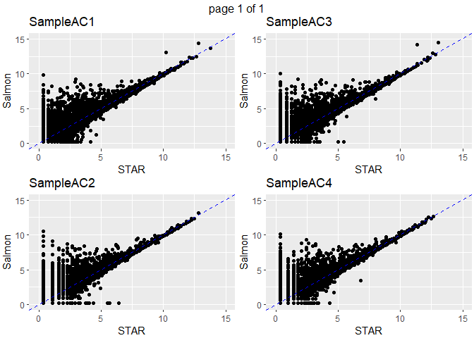
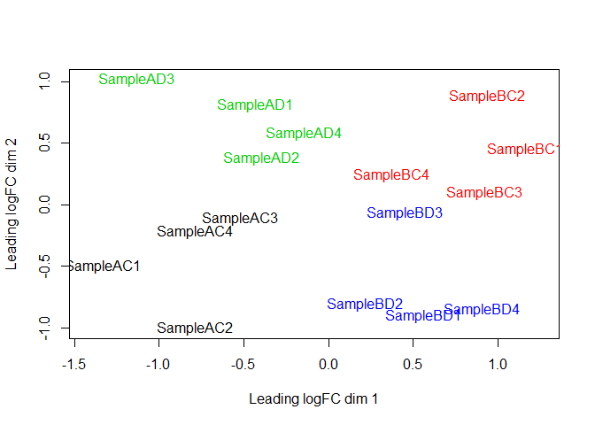
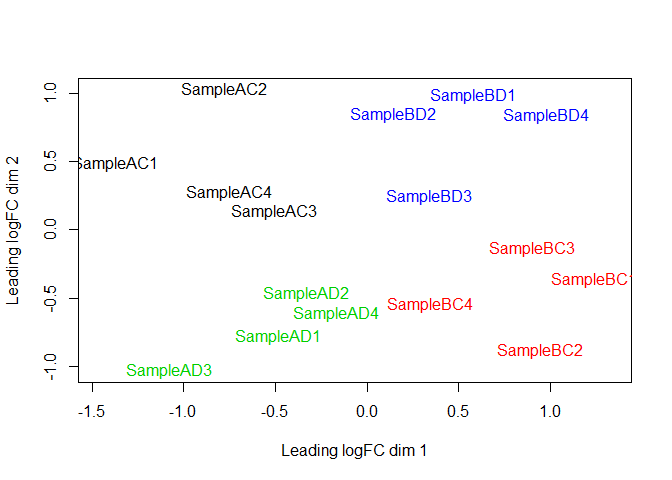
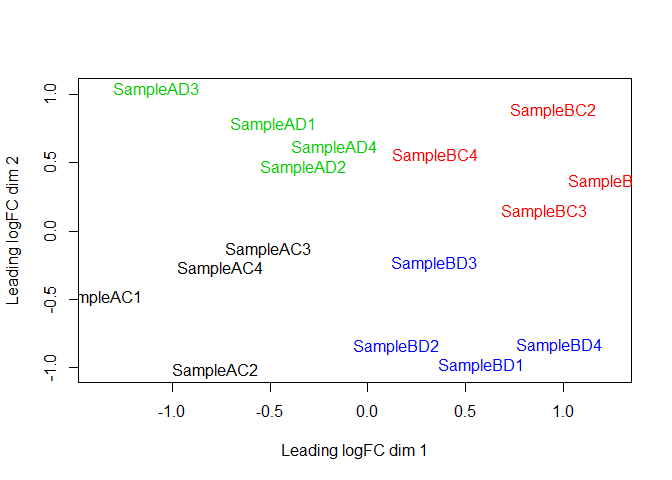

### Pairwise correlations of normalized counts on same sample


<!-- -->

(Figure shows 4 samples, these are representative of pattern on remaining samples.)

Note the pattern of genes with low expression with STAR and high expression with Salmon.

### MDS plot, STAR counts:
<!-- -->

### MDS plot, Salmon counts
<!-- -->

Note that you can rotate or flip an MDS plot without changing the distances between samples (the orientation is arbitrary).  Here's the Salmon MDS plot rotated to match the orientation of the STAR MDS plot:

<!-- -->


### Top 10 genes with STAR

```
##     Gene.stable.ID HGNC.symbol     logFC  AveExpr         t      P.Value
## 1  ENSG00000129824      RPS4Y1 -6.014740 3.826209 -7.151711 7.192005e-07
## 2  ENSG00000067048       DDX3Y -6.403500 2.913309 -6.830168 1.382919e-06
## 3  ENSG00000012817       KDM5D -6.390275 2.940730 -6.718986 1.739325e-06
## 4  ENSG00000198692      EIF1AY -5.184644 1.887900 -6.693343 1.834216e-06
## 5  ENSG00000099725        PRKY -5.826135 2.973758 -6.443233 3.093471e-06
## 6  ENSG00000183878         UTY -5.060957 2.437612 -6.356324 3.716707e-06
## 7  ENSG00000111052       LIN7A -1.675545 5.558748 -6.134283 5.966643e-06
## 8  ENSG00000114374       USP9Y -5.196104 1.973817 -5.754669 1.359469e-05
## 9  ENSG00000131002      TXLNGY -5.396197 2.403759 -5.741837 1.398266e-05
## 10 ENSG00000173597     SULT1B1 -1.348515 6.533206 -5.420129 2.848455e-05
##      adj.P.Val        B
## 1  0.006643531 4.687789
## 2  0.006643531 2.965094
## 3  0.006643531 2.974988
## 4  0.006643531 2.138306
## 5  0.008963642 3.051457
## 6  0.008974608 2.509162
## 7  0.012349247 4.011984
## 8  0.022508972 1.508833
## 9  0.022508972 1.847063
## 10 0.041268410 2.625203
```

### Top 10 genes with Salmon

```
##     Gene.stable.ID HGNC.symbol     logFC  AveExpr         t      P.Value
## 1  ENSG00000129824      RPS4Y1 -5.964371 3.665746 -6.954325 1.386850e-06
## 2  ENSG00000067048       DDX3Y -6.352257 2.759204 -6.775343 1.978005e-06
## 3  ENSG00000198692      EIF1AY -4.964644 1.794527 -6.527168 3.259416e-06
## 4  ENSG00000012817       KDM5D -6.294545 2.770694 -6.495961 3.472717e-06
## 5  ENSG00000099725        PRKY -4.659910 3.160600 -6.220045 6.116606e-06
## 6  ENSG00000183878         UTY -4.913783 2.241138 -6.133448 7.320855e-06
## 7  ENSG00000111052       LIN7A -1.670540 5.402575 -5.983866 1.000851e-05
## 8  ENSG00000131002      TXLNGY -5.260164 2.217746 -5.598758 2.267707e-05
## 9  ENSG00000114374       USP9Y -5.072640 1.879345 -5.494636 2.837586e-05
## 10 ENSG00000131724     IL13RA1 -1.155352 7.144644 -5.286023 4.462809e-05
##     adj.P.Val        B
## 1  0.01257210 4.142661
## 2  0.01257210 2.827628
## 3  0.01257210 2.044915
## 4  0.01257210 2.619452
## 5  0.01766888 3.199943
## 6  0.01766888 2.143609
## 7  0.02070475 3.546144
## 8  0.04104833 1.561104
## 9  0.04565676 1.157373
## 10 0.06462593 2.223904
```

10 genes are DE (adjusted P < 0.05) with STAR, and 9 genes are DE with Salmon.  All genes DE with Salmon are DE with STAR.

### Conclusions
* STAR and Salmon show differences in quantification of low expressed genes.
* This does not seem to have much impact on the relative distances between samples or differential expression (note that low expressed genes are often filtered out before analysis).
* Pick one approach for a project and go with it.
* Don't run multiple analyses and pick the one that gives you the most DE genes.


