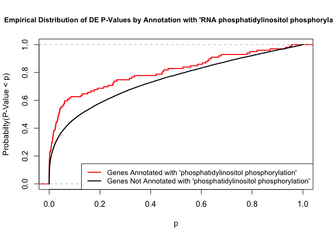
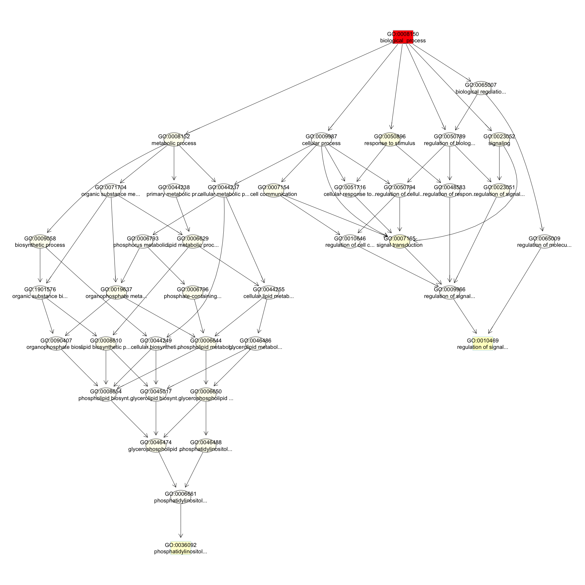

# GO AND KEGG Enrichment Analysis

Load libraries

```r
library(topGO)
```

```
## Loading required package: BiocGenerics
```

```
## Loading required package: parallel
```

```
## 
## Attaching package: 'BiocGenerics'
```

```
## The following objects are masked from 'package:parallel':
## 
##     clusterApply, clusterApplyLB, clusterCall, clusterEvalQ,
##     clusterExport, clusterMap, parApply, parCapply, parLapply,
##     parLapplyLB, parRapply, parSapply, parSapplyLB
```

```
## The following objects are masked from 'package:stats':
## 
##     IQR, mad, sd, var, xtabs
```

```
## The following objects are masked from 'package:base':
## 
##     anyDuplicated, append, as.data.frame, basename, cbind,
##     colnames, dirname, do.call, duplicated, eval, evalq, Filter,
##     Find, get, grep, grepl, intersect, is.unsorted, lapply, Map,
##     mapply, match, mget, order, paste, pmax, pmax.int, pmin,
##     pmin.int, Position, rank, rbind, Reduce, rownames, sapply,
##     setdiff, sort, table, tapply, union, unique, unsplit, which,
##     which.max, which.min
```

```
## Loading required package: graph
```

```
## Loading required package: Biobase
```

```
## Welcome to Bioconductor
## 
##     Vignettes contain introductory material; view with
##     'browseVignettes()'. To cite Bioconductor, see
##     'citation("Biobase")', and for packages 'citation("pkgname")'.
```

```
## Loading required package: GO.db
```

```
## Loading required package: AnnotationDbi
```

```
## Loading required package: stats4
```

```
## Loading required package: IRanges
```

```
## Loading required package: S4Vectors
```

```
## 
## Attaching package: 'S4Vectors'
```

```
## The following object is masked from 'package:base':
## 
##     expand.grid
```

```
## 
```

```
## Loading required package: SparseM
```

```
## 
## Attaching package: 'SparseM'
```

```
## The following object is masked from 'package:base':
## 
##     backsolve
```

```
## 
## groupGOTerms: 	GOBPTerm, GOMFTerm, GOCCTerm environments built.
```

```
## 
## Attaching package: 'topGO'
```

```
## The following object is masked from 'package:IRanges':
## 
##     members
```

```r
library(KEGGREST)
library(org.Hs.eg.db)
```

```
## 
```

Files for examples created in the DE analysis

## Gene Ontology (GO) Enrichment

Gene ontology (http://www.geneontology.org/) provides a controlled vocabulary for describing biological processes (BP ontology), molecular functions (MF ontology) and cellular components (CC ontology)

The GO ontologies themselves are organism-independent; terms are associated with genes for a specific organism through direct experimentation or through sequence homology with another organism and its GO annotation.

Terms are related to other terms through parent-child relationships in a directed acylic graph.

Enrichment analysis provides one way of drawing conclusions about a set of differential expression results.

**1\.** topGO Example Using Kolmogorov-Smirnov Testing
Our first example uses Kolmogorov-Smirnov Testing for enrichment testing of our human DE results, with GO annotation obtained from the Bioconductor database org.Hs.eg.db.

The first step in each topGO analysis is to create a topGOdata object.  This contains the genes, the score for each gene (here we use the p-value from the DE test), the GO terms associated with each gene, and the ontology to be used (here we use the biological process ontology)

```r
infile <- "A.C_v_B.C.txt"
tmp <- read.delim(infile)

geneList <- tmp$P.Value
xx <- as.list(org.Hs.egENSEMBL2EG)
names(geneList) <- xx[tmp$Gene]

# Create topGOData object
GOdata <- new("topGOdata",
	ontology = "BP",
	allGenes = geneList,
	geneSelectionFun = function(x)x,
	annot = annFUN.org , mapping = "org.Hs.eg.db")
```

```
## 
## Building most specific GOs .....
```

```
## 	( 11330 GO terms found. )
```

```
## 
## Build GO DAG topology ..........
```

```
## 	( 15346 GO terms and 36423 relations. )
```

```
## 
## Annotating nodes ...............
```

```
## 	( 11714 genes annotated to the GO terms. )
```

**2\.** The topGOdata object is then used as input for enrichment testing:

```r
# Kolmogorov-Smirnov testing
resultKS <- runTest(GOdata, algorithm = "weight01", statistic = "ks")
```

```
## 
## 			 -- Weight01 Algorithm -- 
## 
## 		 the algorithm is scoring 15346 nontrivial nodes
## 		 parameters: 
## 			 test statistic: ks
## 			 score order: increasing
```

```
## 
## 	 Level 20:	1 nodes to be scored	(0 eliminated genes)
```

```
## 
## 	 Level 19:	5 nodes to be scored	(0 eliminated genes)
```

```
## 
## 	 Level 18:	21 nodes to be scored	(1 eliminated genes)
```

```
## 
## 	 Level 17:	47 nodes to be scored	(26 eliminated genes)
```

```
## 
## 	 Level 16:	118 nodes to be scored	(67 eliminated genes)
```

```
## 
## 	 Level 15:	242 nodes to be scored	(170 eliminated genes)
```

```
## 
## 	 Level 14:	475 nodes to be scored	(481 eliminated genes)
```

```
## 
## 	 Level 13:	843 nodes to be scored	(1128 eliminated genes)
```

```
## 
## 	 Level 12:	1255 nodes to be scored	(2277 eliminated genes)
```

```
## 
## 	 Level 11:	1666 nodes to be scored	(4235 eliminated genes)
```

```
## 
## 	 Level 10:	1989 nodes to be scored	(5807 eliminated genes)
```

```
## 
## 	 Level 9:	2100 nodes to be scored	(7059 eliminated genes)
```

```
## 
## 	 Level 8:	1996 nodes to be scored	(8561 eliminated genes)
```

```
## 
## 	 Level 7:	1877 nodes to be scored	(9519 eliminated genes)
```

```
## 
## 	 Level 6:	1410 nodes to be scored	(10407 eliminated genes)
```

```
## 
## 	 Level 5:	775 nodes to be scored	(10892 eliminated genes)
```

```
## 
## 	 Level 4:	367 nodes to be scored	(11258 eliminated genes)
```

```
## 
## 	 Level 3:	134 nodes to be scored	(11447 eliminated genes)
```

```
## 
## 	 Level 2:	24 nodes to be scored	(11512 eliminated genes)
```

```
## 
## 	 Level 1:	1 nodes to be scored	(11562 eliminated genes)
```

```r
tab <- GenTable(GOdata, raw.p.value = resultKS, topNodes = length(resultKS@score), numChar = 120)
```

topGO preferentially tests more specific terms, utilizing the topology of the GO graph. The algorithms used are described in detail [here](https://academic.oup.com/bioinformatics/article/22/13/1600/193669).


```r
head(tab, 15)
```

```
##         GO.ID
## 1  GO:0008150
## 2  GO:0007165
## 3  GO:0045787
## 4  GO:0045104
## 5  GO:0006909
## 6  GO:0051057
## 7  GO:0042058
## 8  GO:0060088
## 9  GO:0031016
## 10 GO:2000503
## 11 GO:0008285
## 12 GO:0030177
## 13 GO:0018108
## 14 GO:0003215
## 15 GO:0048739
##                                                                Term
## 1                                                biological_process
## 2                                               signal transduction
## 3                                 positive regulation of cell cycle
## 4                   intermediate filament cytoskeleton organization
## 5                                                      phagocytosis
## 6  positive regulation of small GTPase mediated signal transduction
## 7  regulation of epidermal growth factor receptor signaling pathway
## 8                  auditory receptor cell stereocilium organization
## 9                                              pancreas development
## 10            positive regulation of natural killer cell chemotaxis
## 11                        negative regulation of cell proliferation
## 12                     positive regulation of Wnt signaling pathway
## 13                                peptidyl-tyrosine phosphorylation
## 14                            cardiac right ventricle morphogenesis
## 15                                 cardiac muscle fiber development
##    Annotated Significant Expected raw.p.value
## 1      11714       11714    11714     < 1e-30
## 2       4310        4310     4310     0.00030
## 3        313         313      313     0.00058
## 4         35          35       35     0.00148
## 5        220         220      220     0.00161
## 6         51          51       51     0.00166
## 7         69          69       69     0.00212
## 8          8           8        8     0.00274
## 9         68          68       68     0.00290
## 10         6           6        6     0.00320
## 11       600         600      600     0.00364
## 12       143         143      143     0.00402
## 13       302         302      302     0.00410
## 14        18          18       18     0.00410
## 15         9           9        9     0.00415
```
* Annotated: number of genes (in our gene list) that are annotated with the term
* Significant: n/a for this example, same as Annotated here
* Expected: n/a for this example, same as Annotated here
* raw.p.value: P-value from Kolomogorov-Smirnov test that DE p-values annotated with the term are smaller (i.e. more significant) than those not annotated with the term.

The Kolmogorov-Smirnov test directly compares two probability distributions based on their maximum distance.  

To illustrate the KS test, we plot probability distributions of p-values that are and that are not annotated with the term "phosphatidylinositol phosphorylation".  (This won't exactly match what topGO does due to their elimination algorithm):

```r
rna.pp.terms <- genesInTerm(GOdata)[["GO:0046854"]] # get genes associated with term
p.values.in <- geneList[names(geneList) %in% rna.pp.terms]
p.values.out <- geneList[!(names(geneList) %in% rna.pp.terms)]
plot.ecdf(p.values.in, verticals = T, do.points = F, col = "red", lwd = 2, xlim = c(0,1),
          main = "Empirical Distribution of DE P-Values by Annotation with 'RNA phosphatidylinositol phosphorylation'",
          cex.main = 0.9, xlab = "p", ylab = "Probabilty(P-Value < p)")
ecdf.out <- ecdf(p.values.out)
xx <- unique(sort(c(seq(0, 1, length = 201), knots(ecdf.out))))
lines(xx, ecdf.out(xx), col = "black", lwd = 2)
legend("bottomright", legend = c("Genes Annotated with 'phosphatidylinositol phosphorylation'", "Genes Not Annotated with 'phosphatidylinositol phosphorylation'"), lwd = 2, col = 2:1, cex = 0.9)
```

<!-- -->

We can use the function showSigOfNodes to plot the GO graph for the 3 most significant terms and their parents, color coded by enrichment p-value (red is most significant):

```r
par(cex = 0.3)
showSigOfNodes(GOdata, score(resultKS), firstSigNodes = 3, useInfo = "def")
```

```
## Loading required package: Rgraphviz
```

```
## Loading required package: grid
```

```
## 
## Attaching package: 'grid'
```

```
## The following object is masked from 'package:topGO':
## 
##     depth
```

```
## 
## Attaching package: 'Rgraphviz'
```

```
## The following objects are masked from 'package:IRanges':
## 
##     from, to
```

```
## The following objects are masked from 'package:S4Vectors':
## 
##     from, to
```

<!-- -->

```
## $dag
## A graphNEL graph with directed edges
## Number of Nodes = 15 
## Number of Edges = 27 
## 
## $complete.dag
## [1] "A graph with 15 nodes."
```

```r
par(cex = 1)
```

**3\.** topGO Example Using Fisher's Exact Test
Next, we use Fisher's exact test to test for GO enrichment among significantly DE genes.

Create topGOdata object:

```r
# Create topGOData object
GOdata <- new("topGOdata",
	ontology = "BP",
	allGenes = geneList,
	geneSelectionFun = function(x) (x < 0.05),
	annot = annFUN.org , mapping = "org.Hs.eg.db")
```

```
## 
## Building most specific GOs .....
```

```
## 	( 11330 GO terms found. )
```

```
## 
## Build GO DAG topology ..........
```

```
## 	( 15346 GO terms and 36423 relations. )
```

```
## 
## Annotating nodes ...............
```

```
## 	( 11714 genes annotated to the GO terms. )
```

Run Fisher's Exact Test:

```r
resultFisher <- runTest(GOdata, algorithm = "elim", statistic = "fisher")
```

```
## 
## 			 -- Elim Algorithm -- 
## 
## 		 the algorithm is scoring 12563 nontrivial nodes
## 		 parameters: 
## 			 test statistic: fisher
## 			 cutOff: 0.01
```

```
## 
## 	 Level 19:	1 nodes to be scored	(0 eliminated genes)
```

```
## 
## 	 Level 18:	15 nodes to be scored	(0 eliminated genes)
```

```
## 
## 	 Level 17:	36 nodes to be scored	(0 eliminated genes)
```

```
## 
## 	 Level 16:	82 nodes to be scored	(0 eliminated genes)
```

```
## 
## 	 Level 15:	183 nodes to be scored	(0 eliminated genes)
```

```
## 
## 	 Level 14:	370 nodes to be scored	(127 eliminated genes)
```

```
## 
## 	 Level 13:	644 nodes to be scored	(127 eliminated genes)
```

```
## 
## 	 Level 12:	954 nodes to be scored	(1939 eliminated genes)
```

```
## 
## 	 Level 11:	1311 nodes to be scored	(2378 eliminated genes)
```

```
## 
## 	 Level 10:	1585 nodes to be scored	(3443 eliminated genes)
```

```
## 
## 	 Level 9:	1730 nodes to be scored	(4570 eliminated genes)
```

```
## 
## 	 Level 8:	1668 nodes to be scored	(5374 eliminated genes)
```

```
## 
## 	 Level 7:	1571 nodes to be scored	(7408 eliminated genes)
```

```
## 
## 	 Level 6:	1229 nodes to be scored	(8680 eliminated genes)
```

```
## 
## 	 Level 5:	691 nodes to be scored	(10072 eliminated genes)
```

```
## 
## 	 Level 4:	341 nodes to be scored	(11005 eliminated genes)
```

```
## 
## 	 Level 3:	129 nodes to be scored	(11281 eliminated genes)
```

```
## 
## 	 Level 2:	22 nodes to be scored	(11405 eliminated genes)
```

```
## 
## 	 Level 1:	1 nodes to be scored	(11488 eliminated genes)
```

```r
tab <- GenTable(GOdata, raw.p.value = resultFisher, topNodes = length(resultFisher@score),
				numChar = 120)
head(tab)
```

```
##        GO.ID                                     Term Annotated
## 1 GO:0008150                       biological_process     11714
## 2 GO:0009987                         cellular process     10689
## 3 GO:0007165                      signal transduction      4310
## 4 GO:0043066 negative regulation of apoptotic process       755
## 5 GO:0044237               cellular metabolic process      7587
## 6 GO:0043065 positive regulation of apoptotic process       548
##   Significant Expected raw.p.value
## 1        4612  4430.19     < 1e-30
## 2        4213  4042.54     1.4e-11
## 3        1756  1630.02     2.9e-07
## 4         325   285.54     3.2e-06
## 5        2973  2869.37     6.0e-06
## 6         235   207.25     2.4e-05
```
* Annotated: number of genes (in our gene list) that are annotated with the term
* Significant: Number of significantly DE genes annotated with that term (i.e. genes where geneList = 1)
* Expected: Under random chance, number of genes that would be expected to be significantly DE and annotated with that term
* raw.p.value: P-value from Fisher's Exact Test, testing for association between significance and pathway membership.

Fisher's Exact Test is applied to the table:

**Significance/Annotation**|**Annotated With GO Term**|**Not Annotated With GO Term**
:-----:|:-----:|:-----:
**Significantly DE**|n1|n3
**Not Significantly DE**|n2|n4

and compares the probability of the observed table, conditional on the row and column sums, to what would be expected under random chance.  

Advantages over KS (or Wilcoxon) Tests:

*Ease of interpretation

Disadvantages:

* Relies on significant/non-significant dichotomy (an interesting gene could have an adjusted p-value of 0.051 and be counted as non-significant)
* Less powerful
* May be less useful if there are very few (or a large number of) significant genes

##. KEGG Pathway Enrichment Testing With KEGGREST
KEGG, the Kyoto Encyclopedia of Genes and Genomes (https://www.genome.jp/kegg/), provides assignment of genes for many organisms into pathways.

We will access KEGG pathway assignments for human through the KEGGREST Bioconductor package, and then use some homebrew code for enrichment testing.

**1\.** Get all human pathways and their genes:

```r
# Pull all pathways for AT
pathways.list <- keggList("pathway", "hsa")
head(pathways.list)
```

```
##                                                     path:hsa00010 
##             "Glycolysis / Gluconeogenesis - Homo sapiens (human)" 
##                                                     path:hsa00020 
##                "Citrate cycle (TCA cycle) - Homo sapiens (human)" 
##                                                     path:hsa00030 
##                "Pentose phosphate pathway - Homo sapiens (human)" 
##                                                     path:hsa00040 
## "Pentose and glucuronate interconversions - Homo sapiens (human)" 
##                                                     path:hsa00051 
##          "Fructose and mannose metabolism - Homo sapiens (human)" 
##                                                     path:hsa00052 
##                     "Galactose metabolism - Homo sapiens (human)"
```

```r
# Pull all genes for each pathway
pathway.codes <- sub("path:", "", names(pathways.list))
genes.by.pathway <- sapply(pathway.codes,
	function(pwid){
		pw <- keggGet(pwid)
		if (is.null(pw[[1]]$GENE)) return(NA)
		pw2 <- pw[[1]]$GENE[c(TRUE,FALSE)] # may need to modify this to c(FALSE, TRUE) for other organisms
		pw2 <- unlist(lapply(strsplit(pw2, split = ";", fixed = T), function(x)x[1]))
		return(pw2)
	}
)
head(genes.by.pathway)
```

```
## $hsa00010
##  [1] "10327"  "124"    "125"    "126"    "127"    "128"    "130"   
##  [8] "130589" "131"    "160287" "1737"   "1738"   "2023"   "2026"  
## [15] "2027"   "217"    "218"    "219"    "220"    "2203"   "221"   
## [22] "222"    "223"    "224"    "226"    "229"    "230"    "2538"  
## [29] "2597"   "26330"  "2645"   "2821"   "3098"   "3099"   "3101"  
## [36] "387712" "3939"   "3945"   "3948"   "441531" "501"    "5105"  
## [43] "5106"   "5160"   "5161"   "5162"   "5211"   "5213"   "5214"  
## [50] "5223"   "5224"   "5230"   "5232"   "5236"   "5313"   "5315"  
## [57] "55276"  "55902"  "57818"  "669"    "7167"   "80201"  "83440" 
## [64] "84532"  "8789"   "92483"  "92579"  "9562"  
## 
## $hsa00020
##  [1] "1431"  "1737"  "1738"  "1743"  "2271"  "3417"  "3418"  "3419" 
##  [9] "3420"  "3421"  "4190"  "4191"  "47"    "48"    "4967"  "50"   
## [17] "5091"  "5105"  "5106"  "5160"  "5161"  "5162"  "55753" "6389" 
## [25] "6390"  "6391"  "6392"  "8801"  "8802"  "8803" 
## 
## $hsa00030
##  [1] "132158" "2203"   "221823" "226"    "229"    "22934"  "230"   
##  [8] "2539"   "25796"  "2821"   "414328" "51071"  "5211"   "5213"  
## [15] "5214"   "5226"   "5236"   "55276"  "5631"   "5634"   "6120"  
## [22] "64080"  "6888"   "7086"   "729020" "8277"   "84076"  "8789"  
## [29] "9104"   "9563"  
## 
## $hsa00040
##  [1] "10327"  "10720"  "10941"  "231"    "27294"  "2990"   "51084" 
##  [8] "51181"  "54490"  "54575"  "54576"  "54577"  "54578"  "54579" 
## [15] "54600"  "54657"  "54658"  "54659"  "57016"  "574537" "6120"  
## [22] "6652"   "729020" "729920" "7358"   "7360"   "7363"   "7364"  
## [29] "7365"   "7366"   "7367"   "79799"  "9365"   "9942"  
## 
## $hsa00051
##  [1] "197258" "2203"   "226"    "229"    "230"    "231"    "26007" 
##  [8] "2762"   "29925"  "29926"  "3098"   "3099"   "3101"   "3795"  
## [15] "4351"   "5207"   "5208"   "5209"   "5210"   "5211"   "5213"  
## [22] "5214"   "5372"   "5373"   "55556"  "57016"  "57103"  "6652"  
## [29] "7167"   "7264"   "80201"  "8789"   "8790"  
## 
## $hsa00052
##  [1] "130589" "231"    "2538"   "2548"   "2582"   "2584"   "2592"  
##  [8] "2595"   "2645"   "2683"   "2717"   "2720"   "3098"   "3099"  
## [15] "3101"   "3906"   "3938"   "5211"   "5213"   "5214"   "5236"  
## [22] "55276"  "57016"  "57818"  "6476"   "7360"   "80201"  "8704"  
## [29] "8972"   "92579"  "93432"
```

Read in DE file to be used in enrichment testing:

```r
head(geneList)
```

```
##         2268        57188         3964         3744         6286 
## 6.496525e-09 1.440800e-08 2.552955e-08 4.106524e-08 4.463872e-08 
##         8659 
## 9.412370e-08
```

**2\.** Apply Wilcoxon rank-sum test to each pathway, testing if "in" p-values are smaller than "out" p-values:

```r
# Wilcoxon test for each pathway
pVals.by.pathway <- t(sapply(names(genes.by.pathway),
	function(pathway) {
		pathway.genes <- genes.by.pathway[[pathway]]
		list.genes.in.pathway <- intersect(names(geneList), pathway.genes)
		list.genes.not.in.pathway <- setdiff(names(geneList), list.genes.in.pathway)
		scores.in.pathway <- geneList[list.genes.in.pathway]
		scores.not.in.pathway <- geneList[list.genes.not.in.pathway]
		if (length(scores.in.pathway) > 0){
			p.value <- wilcox.test(scores.in.pathway, scores.not.in.pathway, alternative = "less")$p.value
		} else{
			p.value <- NA
		}
		return(c(p.value = p.value, Annotated = length(list.genes.in.pathway)))
	}
))

# Assemble output table
outdat <- data.frame(pathway.code = rownames(pVals.by.pathway))
outdat$pathway.name <- pathways.list[outdat$pathway.code]
outdat$p.value <- pVals.by.pathway[,"p.value"]
outdat$Annotated <- pVals.by.pathway[,"Annotated"]
outdat <- outdat[order(outdat$p.value),]
head(outdat)
```

```
##     pathway.code
## 179     hsa04612
## 329     hsa05332
## 188     hsa04650
## 328     hsa05330
## 242     hsa04940
## 327     hsa05323
##                                                         pathway.name
## 179       Antigen processing and presentation - Homo sapiens (human)
## 329                 Graft-versus-host disease - Homo sapiens (human)
## 188 Natural killer cell mediated cytotoxicity - Homo sapiens (human)
## 328                       Allograft rejection - Homo sapiens (human)
## 242                  Type I diabetes mellitus - Homo sapiens (human)
## 327                      Rheumatoid arthritis - Homo sapiens (human)
##          p.value Annotated
## 179 1.840993e-08        74
## 329 2.009811e-08        40
## 188 8.400982e-07       118
## 328 9.050700e-06        36
## 242 2.435849e-05        42
## 327 2.827471e-05        84
```
* p.value: P-value for Wilcoxon rank-sum testing, testing that p-values from DE analysis for genes in the pathway are smaller than those not in the pathway
* Annotated: Number of genes in the pathway (regardless of DE p-value)

The Wilcoxon rank-sum test is the nonparametric analogue of the two-sample t-test.  It compares the ranks of observations in two groups.  It is more powerful than the Kolmogorov-Smirnov test.


```r
sessionInfo()
```

```
## R version 3.6.1 (2019-07-05)
## Platform: x86_64-apple-darwin15.6.0 (64-bit)
## Running under: macOS Mojave 10.14.6
## 
## Matrix products: default
## BLAS:   /Library/Frameworks/R.framework/Versions/3.6/Resources/lib/libRblas.0.dylib
## LAPACK: /Library/Frameworks/R.framework/Versions/3.6/Resources/lib/libRlapack.dylib
## 
## locale:
## [1] en_US.UTF-8/en_US.UTF-8/en_US.UTF-8/C/en_US.UTF-8/en_US.UTF-8
## 
## attached base packages:
##  [1] grid      stats4    parallel  stats     graphics  grDevices utils    
##  [8] datasets  methods   base     
## 
## other attached packages:
##  [1] Rgraphviz_2.28.0     org.Hs.eg.db_3.8.2   KEGGREST_1.24.0     
##  [4] topGO_2.36.0         SparseM_1.77         GO.db_3.8.2         
##  [7] AnnotationDbi_1.46.1 IRanges_2.18.1       S4Vectors_0.22.0    
## [10] Biobase_2.44.0       graph_1.62.0         BiocGenerics_0.30.0 
## 
## loaded via a namespace (and not attached):
##  [1] Rcpp_1.0.2         XVector_0.24.0     compiler_3.6.1    
##  [4] pillar_1.4.2       zlibbioc_1.30.0    tools_3.6.1       
##  [7] zeallot_0.1.0      digest_0.6.20      bit_1.1-14        
## [10] RSQLite_2.1.2      evaluate_0.14      memoise_1.1.0     
## [13] tibble_2.1.3       lattice_0.20-38    png_0.1-7         
## [16] pkgconfig_2.0.2    rlang_0.4.0        DBI_1.0.0         
## [19] curl_4.0           yaml_2.2.0         xfun_0.9          
## [22] httr_1.4.1         stringr_1.4.0      knitr_1.24        
## [25] Biostrings_2.52.0  vctrs_0.2.0        bit64_0.9-7       
## [28] R6_2.4.0           rmarkdown_1.15     blob_1.2.0        
## [31] magrittr_1.5       backports_1.1.4    htmltools_0.3.6   
## [34] matrixStats_0.54.0 stringi_1.4.3      crayon_1.3.4
```
