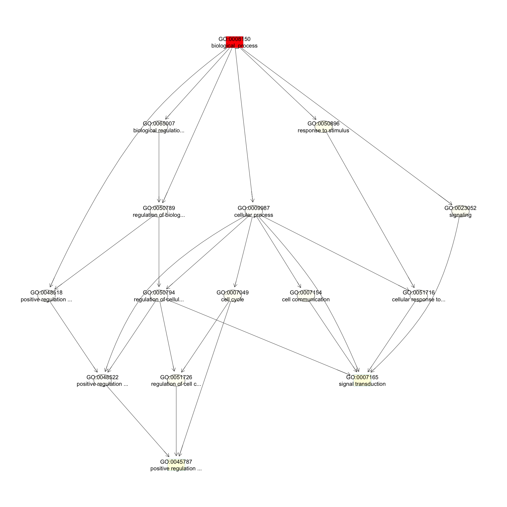

# GO AND KEGG Enrichment Analysis

Load libraries

```r
library(topGO)
```

```
## Loading required package: BiocGenerics
```

```
## Loading required package: parallel
```

```
## 
## Attaching package: 'BiocGenerics'
```

```
## The following objects are masked from 'package:parallel':
## 
##     clusterApply, clusterApplyLB, clusterCall, clusterEvalQ,
##     clusterExport, clusterMap, parApply, parCapply, parLapply,
##     parLapplyLB, parRapply, parSapply, parSapplyLB
```

```
## The following objects are masked from 'package:stats':
## 
##     IQR, mad, sd, var, xtabs
```

```
## The following objects are masked from 'package:base':
## 
##     anyDuplicated, append, as.data.frame, basename, cbind,
##     colMeans, colnames, colSums, dirname, do.call, duplicated,
##     eval, evalq, Filter, Find, get, grep, grepl, intersect,
##     is.unsorted, lapply, lengths, Map, mapply, match, mget, order,
##     paste, pmax, pmax.int, pmin, pmin.int, Position, rank, rbind,
##     Reduce, rowMeans, rownames, rowSums, sapply, setdiff, sort,
##     table, tapply, union, unique, unsplit, which, which.max,
##     which.min
```

```
## Loading required package: graph
```

```
## Loading required package: Biobase
```

```
## Welcome to Bioconductor
## 
##     Vignettes contain introductory material; view with
##     'browseVignettes()'. To cite Bioconductor, see
##     'citation("Biobase")', and for packages 'citation("pkgname")'.
```

```
## Loading required package: GO.db
```

```
## Loading required package: AnnotationDbi
```

```
## Loading required package: stats4
```

```
## Loading required package: IRanges
```

```
## Loading required package: S4Vectors
```

```
## 
## Attaching package: 'S4Vectors'
```

```
## The following object is masked from 'package:base':
## 
##     expand.grid
```

```
## 
```

```
## Loading required package: SparseM
```

```
## 
## Attaching package: 'SparseM'
```

```
## The following object is masked from 'package:base':
## 
##     backsolve
```

```
## 
## groupGOTerms: 	GOBPTerm, GOMFTerm, GOCCTerm environments built.
```

```
## 
## Attaching package: 'topGO'
```

```
## The following object is masked from 'package:IRanges':
## 
##     members
```

```r
library(KEGGREST)
library(org.Hs.eg.db)
```

```
## 
```

Files for examples created in the DE analysis

## Gene Ontology (GO) Enrichment 

Gene ontology (http://www.geneontology.org/) provides a controlled vocabulary for describing biological processes (BP ontology), molecular functions (MF ontology) and cellular components (CC ontology)

The GO ontologies themselves are organism-independent; terms are associated with genes for a specific organism through direct experimentation or through sequence homology with another organism and its GO annotation.

Terms are related to other terms through parent-child relationships in a directed acylic graph.

Enrichment analysis provides one way of drawing conclusions about a set of differential expression results.

**1\.** topGO Example Using Kolmogorov-Smirnov Testing
Our first example uses Kolmogorov-Smirnov Testing for enrichment testing of our human DE results, with GO annotation obtained from the Bioconductor database org.Hs.eg.db. 

The first step in each topGO analysis is to create a topGOdata object.  This contains the genes, the score for each gene (here we use the p-value from the DE test), the GO terms associated with each gene, and the ontology to be used (here we use the biological process ontology)

```r
infile <- "A.C_v_B.C.txt" 
tmp <- read.delim(infile)

geneList <- tmp$P.Value
xx <- as.list(org.Hs.egENSEMBL2EG)
names(geneList) <- xx[tmp$Gene]

# Create topGOData object
GOdata <- new("topGOdata",
	ontology = "BP",
	allGenes = geneList,
	geneSelectionFun = function(x)x,
	annot = annFUN.org , mapping = "org.Hs.eg.db")
```

```
## 
## Building most specific GOs .....
```

```
## 	( 11452 GO terms found. )
```

```
## 
## Build GO DAG topology ..........
```

```
## 	( 15569 GO terms and 36870 relations. )
```

```
## 
## Annotating nodes ...............
```

```
## 	( 11788 genes annotated to the GO terms. )
```

**2\.** The topGOdata object is then used as input for enrichment testing:

```r
# Kolmogorov-Smirnov testing
resultKS <- runTest(GOdata, algorithm = "weight01", statistic = "ks")
```

```
## 
## 			 -- Weight01 Algorithm -- 
## 
## 		 the algorithm is scoring 15569 nontrivial nodes
## 		 parameters: 
## 			 test statistic: ks
## 			 score order: increasing
```

```
## 
## 	 Level 20:	1 nodes to be scored	(0 eliminated genes)
```

```
## 
## 	 Level 19:	5 nodes to be scored	(0 eliminated genes)
```

```
## 
## 	 Level 18:	21 nodes to be scored	(1 eliminated genes)
```

```
## 
## 	 Level 17:	48 nodes to be scored	(23 eliminated genes)
```

```
## 
## 	 Level 16:	117 nodes to be scored	(64 eliminated genes)
```

```
## 
## 	 Level 15:	239 nodes to be scored	(183 eliminated genes)
```

```
## 
## 	 Level 14:	480 nodes to be scored	(474 eliminated genes)
```

```
## 
## 	 Level 13:	871 nodes to be scored	(1172 eliminated genes)
```

```
## 
## 	 Level 12:	1304 nodes to be scored	(2338 eliminated genes)
```

```
## 
## 	 Level 11:	1698 nodes to be scored	(4446 eliminated genes)
```

```
## 
## 	 Level 10:	2017 nodes to be scored	(6118 eliminated genes)
```

```
## 
## 	 Level 9:	2116 nodes to be scored	(7483 eliminated genes)
```

```
## 
## 	 Level 8:	2026 nodes to be scored	(8964 eliminated genes)
```

```
## 
## 	 Level 7:	1899 nodes to be scored	(9922 eliminated genes)
```

```
## 
## 	 Level 6:	1425 nodes to be scored	(10676 eliminated genes)
```

```
## 
## 	 Level 5:	772 nodes to be scored	(11084 eliminated genes)
```

```
## 
## 	 Level 4:	370 nodes to be scored	(11442 eliminated genes)
```

```
## 
## 	 Level 3:	135 nodes to be scored	(11585 eliminated genes)
```

```
## 
## 	 Level 2:	24 nodes to be scored	(11637 eliminated genes)
```

```
## 
## 	 Level 1:	1 nodes to be scored	(11674 eliminated genes)
```

```r
tab <- GenTable(GOdata, raw.p.value = resultKS, topNodes = length(resultKS@score), numChar = 120)
```

topGO preferentially tests more specific terms, utilizing the topology of the GO graph. The algorithms used are described in detail [here](https://academic.oup.com/bioinformatics/article/22/13/1600/193669).


```r
head(tab, 15)
```

```
##         GO.ID
## 1  GO:0008150
## 2  GO:0010469
## 3  GO:0036092
## 4  GO:0045597
## 5  GO:0051775
## 6  GO:0021549
## 7  GO:0048678
## 8  GO:0046854
## 9  GO:0051897
## 10 GO:0045665
## 11 GO:0002876
## 12 GO:0071363
## 13 GO:0015701
## 14 GO:0045599
## 15 GO:0010971
##                                                                          Term
## 1                                                          biological_process
## 2                                   regulation of signaling receptor activity
## 3                       phosphatidylinositol-3-phosphate biosynthetic process
## 4                                 positive regulation of cell differentiation
## 5                                                     response to redox state
## 6                                                      cerebellum development
## 7                                                     response to axon injury
## 8                                        phosphatidylinositol phosphorylation
## 9                           positive regulation of protein kinase B signaling
## 10                              negative regulation of neuron differentiation
## 11 positive regulation of chronic inflammatory response to antigenic stimulus
## 12                                cellular response to growth factor stimulus
## 13                                                      bicarbonate transport
## 14                            negative regulation of fat cell differentiation
## 15               positive regulation of G2/M transition of mitotic cell cycle
##    Annotated Significant Expected raw.p.value
## 1      11788       11788    11788     < 1e-30
## 2        463         463      463     1.7e-05
## 3         51          51       51     6.7e-05
## 4        814         814      814     0.00012
## 5         12          12       12     0.00026
## 6         87          87       87     0.00036
## 7         62          62       62     0.00043
## 8         96          96       96     0.00050
## 9        142         142      142     0.00057
## 10       193         193      193     0.00066
## 11         2           2        2     0.00067
## 12       581         581      581     0.00072
## 13        35          35       35     0.00074
## 14        37          37       37     0.00080
## 15        25          25       25     0.00081
```
* Annotated: number of genes (in our gene list) that are annotated with the term
* Significant: n/a for this example, same as Annotated here
* Expected: n/a for this example, same as Annotated here
* raw.p.value: P-value from Kolomogorov-Smirnov test that DE p-values annotated with the term are smaller (i.e. more significant) than those not annotated with the term.

The Kolmogorov-Smirnov test directly compares two probability distributions based on their maximum distance.  

To illustrate the KS test, we plot probability distributions of p-values that are and that are not annotated with the term "phosphatidylinositol phosphorylation".  (This won't exactly match what topGO does due to their elimination algorithm):

```r
rna.pp.terms <- genesInTerm(GOdata)[["GO:0046854"]] # get genes associated with term
p.values.in <- geneList[names(geneList) %in% rna.pp.terms]
p.values.out <- geneList[!(names(geneList) %in% rna.pp.terms)]
plot.ecdf(p.values.in, verticals = T, do.points = F, col = "red", lwd = 2, xlim = c(0,1),
          main = "Empirical Distribution of DE P-Values by Annotation with 'RNA phosphatidylinositol phosphorylation'",
          cex.main = 0.9, xlab = "p", ylab = "Probabilty(P-Value < p)")
ecdf.out <- ecdf(p.values.out)
xx <- unique(sort(c(seq(0, 1, length = 201), knots(ecdf.out))))
lines(xx, ecdf.out(xx), col = "black", lwd = 2)
legend("bottomright", legend = c("Genes Annotated with 'phosphatidylinositol phosphorylation'", "Genes Not Annotated with 'phosphatidylinositol phosphorylation'"), lwd = 2, col = 2:1, cex = 0.9)
```

<!-- -->

We can use the function showSigOfNodes to plot the GO graph for the 3 most significant terms and their parents, color coded by enrichment p-value (red is most significant):

```r
par(cex = 0.3)
showSigOfNodes(GOdata, score(resultKS), firstSigNodes = 3, useInfo = "def")
```

```
## Loading required package: Rgraphviz
```

```
## Loading required package: grid
```

```
## 
## Attaching package: 'grid'
```

```
## The following object is masked from 'package:topGO':
## 
##     depth
```

```
## 
## Attaching package: 'Rgraphviz'
```

```
## The following objects are masked from 'package:IRanges':
## 
##     from, to
```

```
## The following objects are masked from 'package:S4Vectors':
## 
##     from, to
```

<!-- -->

```
## $dag
## A graphNEL graph with directed edges
## Number of Nodes = 39 
## Number of Edges = 71 
## 
## $complete.dag
## [1] "A graph with 39 nodes."
```

```r
par(cex = 1)
```

**3\.** topGO Example Using Fisher's Exact Test
Next, we use Fisher's exact test to test for GO enrichment among significantly DE genes.

Create topGOdata object:

```r
# Create topGOData object
GOdata <- new("topGOdata",
	ontology = "BP",
	allGenes = geneList,
	geneSelectionFun = function(x) (x < 0.05),
	annot = annFUN.org , mapping = "org.Hs.eg.db")
```

```
## 
## Building most specific GOs .....
```

```
## 	( 11452 GO terms found. )
```

```
## 
## Build GO DAG topology ..........
```

```
## 	( 15569 GO terms and 36870 relations. )
```

```
## 
## Annotating nodes ...............
```

```
## 	( 11788 genes annotated to the GO terms. )
```

Run Fisher's Exact Test:

```r
resultFisher <- runTest(GOdata, algorithm = "elim", statistic = "fisher")
```

```
## 
## 			 -- Elim Algorithm -- 
## 
## 		 the algorithm is scoring 12792 nontrivial nodes
## 		 parameters: 
## 			 test statistic: fisher
## 			 cutOff: 0.01
```

```
## 
## 	 Level 19:	4 nodes to be scored	(0 eliminated genes)
```

```
## 
## 	 Level 18:	16 nodes to be scored	(0 eliminated genes)
```

```
## 
## 	 Level 17:	36 nodes to be scored	(0 eliminated genes)
```

```
## 
## 	 Level 16:	85 nodes to be scored	(0 eliminated genes)
```

```
## 
## 	 Level 15:	182 nodes to be scored	(0 eliminated genes)
```

```
## 
## 	 Level 14:	362 nodes to be scored	(28 eliminated genes)
```

```
## 
## 	 Level 13:	645 nodes to be scored	(241 eliminated genes)
```

```
## 
## 	 Level 12:	974 nodes to be scored	(1726 eliminated genes)
```

```
## 
## 	 Level 11:	1376 nodes to be scored	(2506 eliminated genes)
```

```
## 
## 	 Level 10:	1647 nodes to be scored	(3866 eliminated genes)
```

```
## 
## 	 Level 9:	1763 nodes to be scored	(4940 eliminated genes)
```

```
## 
## 	 Level 8:	1690 nodes to be scored	(6109 eliminated genes)
```

```
## 
## 	 Level 7:	1598 nodes to be scored	(7195 eliminated genes)
```

```
## 
## 	 Level 6:	1229 nodes to be scored	(8267 eliminated genes)
```

```
## 
## 	 Level 5:	681 nodes to be scored	(9956 eliminated genes)
```

```
## 
## 	 Level 4:	347 nodes to be scored	(10904 eliminated genes)
```

```
## 
## 	 Level 3:	133 nodes to be scored	(11228 eliminated genes)
```

```
## 
## 	 Level 2:	23 nodes to be scored	(11437 eliminated genes)
```

```
## 
## 	 Level 1:	1 nodes to be scored	(11659 eliminated genes)
```

```r
tab <- GenTable(GOdata, raw.p.value = resultFisher, topNodes = length(resultFisher@score),
				numChar = 120)
head(tab)
```

```
##        GO.ID                                                      Term
## 1 GO:0008150                                        biological_process
## 2 GO:0009987                                          cellular process
## 3 GO:0043066                  negative regulation of apoptotic process
## 4 GO:0050789                          regulation of biological process
## 5 GO:0045944 positive regulation of transcription by RNA polymerase II
## 6 GO:0010469                 regulation of signaling receptor activity
##   Annotated Significant Expected raw.p.value
## 1     11788        4614  4426.67     < 1e-30
## 2     10932        4295  4105.22     2.0e-11
## 3       789         343   296.29     4.8e-08
## 4      8125        3237  3051.13     1.0e-07
## 5      1005         423   377.40     1.3e-07
## 6       463         213   173.87     1.3e-07
```
* Annotated: number of genes (in our gene list) that are annotated with the term
* Significant: Number of significantly DE genes annotated with that term (i.e. genes where geneList = 1)
* Expected: Under random chance, number of genes that would be expected to be significantly DE and annotated with that term
* raw.p.value: P-value from Fisher's Exact Test, testing for association between significance and pathway membership.

Fisher's Exact Test is applied to the table:

**Significance/Annotation**|**Annotated With GO Term**|**Not Annotated With GO Term**
:-----:|:-----:|:-----:
**Significantly DE**|n1|n3
**Not Significantly DE**|n2|n4

and compares the probability of the observed table, conditional on the row and column sums, to what would be expected under random chance.  

Advantages over KS (or Wilcoxon) Tests:

*Ease of interpretation

Disadvantages:

* Relies on significant/non-significant dichotomy (an interesting gene could have an adjusted p-value of 0.051 and be counted as non-significant)
* Less powerful
* May be less useful if there are very few (or a large number of) significant genes

##. KEGG Pathway Enrichment Testing With KEGGREST
KEGG, the Kyoto Encyclopedia of Genes and Genomes (https://www.genome.jp/kegg/), provides assignment of genes for many organisms into pathways. 

We will access KEGG pathway assignments for human through the KEGGREST Bioconductor package, and then use some homebrew code for enrichment testing.

**1\.** Get all human pathways and their genes:

```r
# Pull all pathways for AT	
pathways.list <- keggList("pathway", "hsa")
head(pathways.list)
```

```
##                                                     path:hsa00010 
##             "Glycolysis / Gluconeogenesis - Homo sapiens (human)" 
##                                                     path:hsa00020 
##                "Citrate cycle (TCA cycle) - Homo sapiens (human)" 
##                                                     path:hsa00030 
##                "Pentose phosphate pathway - Homo sapiens (human)" 
##                                                     path:hsa00040 
## "Pentose and glucuronate interconversions - Homo sapiens (human)" 
##                                                     path:hsa00051 
##          "Fructose and mannose metabolism - Homo sapiens (human)" 
##                                                     path:hsa00052 
##                     "Galactose metabolism - Homo sapiens (human)"
```

```r
# Pull all genes for each pathway
pathway.codes <- sub("path:", "", names(pathways.list))	
genes.by.pathway <- sapply(pathway.codes,
	function(pwid){
		pw <- keggGet(pwid)
		if (is.null(pw[[1]]$GENE)) return(NA)
		pw2 <- pw[[1]]$GENE[c(TRUE,FALSE)] # may need to modify this to c(FALSE, TRUE) for other organisms
		pw2 <- unlist(lapply(strsplit(pw2, split = ";", fixed = T), function(x)x[1]))
		return(pw2)
	}
)
head(genes.by.pathway)
```

```
## $hsa00010
##  [1] "3101"   "3098"   "3099"   "80201"  "2645"   "2821"   "5213"  
##  [8] "5214"   "5211"   "2203"   "8789"   "230"    "226"    "229"   
## [15] "7167"   "2597"   "26330"  "5232"   "5230"   "5223"   "5224"  
## [22] "441531" "2027"   "2026"   "2023"   "387712" "5315"   "5313"  
## [29] "5161"   "5160"   "5162"   "1737"   "1738"   "160287" "92483" 
## [36] "3939"   "3945"   "3948"   "124"    "125"    "126"    "131"   
## [43] "127"    "128"    "130"    "10327"  "217"    "224"    "219"   
## [50] "501"    "223"    "221"    "222"    "220"    "218"    "84532" 
## [57] "55902"  "130589" "5236"   "55276"  "2538"   "57818"  "92579" 
## [64] "83440"  "669"    "9562"   "5105"   "5106"  
## 
## $hsa00020
##  [1] "1431"  "47"    "50"    "48"    "3417"  "3418"  "3420"  "3421" 
##  [9] "3419"  "55753" "4967"  "1743"  "1738"  "8802"  "8801"  "8803" 
## [17] "6389"  "6390"  "6391"  "6392"  "2271"  "4190"  "4191"  "5091" 
## [25] "5105"  "5106"  "5161"  "5160"  "5162"  "1737" 
## 
## $hsa00030
##  [1] "2821"   "2539"   "25796"  "9563"   "5226"   "6120"   "729020"
##  [8] "7086"   "84076"  "8277"   "6888"   "22934"  "51071"  "64080" 
## [15] "5236"   "55276"  "221823" "5634"   "5631"   "9104"   "414328"
## [22] "132158" "230"    "226"    "229"    "2203"   "8789"   "5213"  
## [29] "5214"   "5211"  
## 
## $hsa00040
##  [1] "2990"   "9365"   "10941"  "79799"  "7367"   "10720"  "54490" 
##  [8] "54578"  "54657"  "54658"  "54659"  "7365"   "54600"  "7364"  
## [15] "54575"  "54576"  "54579"  "7366"   "54577"  "7363"   "574537"
## [22] "7358"   "7360"   "10327"  "51084"  "6120"   "729020" "9942"  
## [29] "231"    "57016"  "51181"  "6652"   "27294"  "729920"
## 
## $hsa00051
##  [1] "4351"   "5373"   "5372"   "29925"  "29926"  "2762"   "7264"  
##  [8] "8790"   "197258" "55556"  "3101"   "3098"   "3099"   "80201" 
## [15] "5213"   "5214"   "5211"   "2203"   "8789"   "5207"   "5208"  
## [22] "5209"   "5210"   "57103"  "3795"   "6652"   "231"    "57016" 
## [29] "230"    "226"    "229"    "7167"   "26007" 
## 
## $hsa00052
##  [1] "130589" "2584"   "2592"   "2582"   "7360"   "5236"   "55276" 
##  [8] "3101"   "3098"   "3099"   "80201"  "2645"   "2538"   "57818" 
## [15] "92579"  "2720"   "3938"   "3906"   "2683"   "8704"   "2717"  
## [22] "231"    "57016"  "5213"   "5214"   "5211"   "8972"   "93432" 
## [29] "2548"   "2595"   "6476"
```

Read in DE file to be used in enrichment testing:

```r
head(geneList)
```

```
##         2260        57017         3920         3695         6234 
## 6.496525e-09 1.440800e-08 2.552955e-08 4.106524e-08 4.463872e-08 
##         8600 
## 9.412370e-08
```

**2\.** Apply Wilcoxon rank-sum test to each pathway, testing if "in" p-values are smaller than "out" p-values:

```r
# Wilcoxon test for each pathway
pVals.by.pathway <- t(sapply(names(genes.by.pathway),
	function(pathway) {
		pathway.genes <- genes.by.pathway[[pathway]]
		list.genes.in.pathway <- intersect(names(geneList), pathway.genes)
		list.genes.not.in.pathway <- setdiff(names(geneList), list.genes.in.pathway)
		scores.in.pathway <- geneList[list.genes.in.pathway]
		scores.not.in.pathway <- geneList[list.genes.not.in.pathway]
		if (length(scores.in.pathway) > 0){
			p.value <- wilcox.test(scores.in.pathway, scores.not.in.pathway, alternative = "less")$p.value
		} else{
			p.value <- NA
		}
		return(c(p.value = p.value, Annotated = length(list.genes.in.pathway)))
	}
))

# Assemble output table
outdat <- data.frame(pathway.code = rownames(pVals.by.pathway))
outdat$pathway.name <- pathways.list[outdat$pathway.code]
outdat$p.value <- pVals.by.pathway[,"p.value"]
outdat$Annotated <- pVals.by.pathway[,"Annotated"]
outdat <- outdat[order(outdat$p.value),]
head(outdat)
```

```
##     pathway.code
## 324     hsa05332
## 177     hsa04612
## 174     hsa04550
## 291     hsa05169
## 143     hsa04145
## 323     hsa05330
##                                                                        pathway.name
## 324                                Graft-versus-host disease - Homo sapiens (human)
## 177                      Antigen processing and presentation - Homo sapiens (human)
## 174 Signaling pathways regulating pluripotency of stem cells - Homo sapiens (human)
## 291                             Epstein-Barr virus infection - Homo sapiens (human)
## 143                                                Phagosome - Homo sapiens (human)
## 323                                      Allograft rejection - Homo sapiens (human)
##          p.value Annotated
## 324 1.782281e-08        39
## 177 2.622320e-08        73
## 174 1.077765e-05       127
## 291 1.569229e-05       198
## 143 2.335727e-05       126
## 323 2.625612e-05        36
```
* p.value: P-value for Wilcoxon rank-sum testing, testing that p-values from DE analysis for genes in the pathway are smaller than those not in the pathway
* Annotated: Number of genes in the pathway (regardless of DE p-value)

The Wilcoxon rank-sum test is the nonparametric analogue of the two-sample t-test.  It compares the ranks of observations in two groups.  It is more powerful than the Kolmogorov-Smirnov test.


```r
sessionInfo()
```

```
## R version 3.5.2 (2018-12-20)
## Platform: x86_64-apple-darwin15.6.0 (64-bit)
## Running under: macOS Mojave 10.14.3
## 
## Matrix products: default
## BLAS: /Library/Frameworks/R.framework/Versions/3.5/Resources/lib/libRblas.0.dylib
## LAPACK: /Library/Frameworks/R.framework/Versions/3.5/Resources/lib/libRlapack.dylib
## 
## locale:
## [1] en_US.UTF-8/en_US.UTF-8/en_US.UTF-8/C/en_US.UTF-8/en_US.UTF-8
## 
## attached base packages:
##  [1] grid      stats4    parallel  stats     graphics  grDevices utils    
##  [8] datasets  methods   base     
## 
## other attached packages:
##  [1] Rgraphviz_2.26.0     org.Hs.eg.db_3.7.0   KEGGREST_1.22.0     
##  [4] topGO_2.34.0         SparseM_1.77         GO.db_3.7.0         
##  [7] AnnotationDbi_1.44.0 IRanges_2.16.0       S4Vectors_0.20.1    
## [10] Biobase_2.42.0       graph_1.60.0         BiocGenerics_0.28.0 
## 
## loaded via a namespace (and not attached):
##  [1] Rcpp_1.0.0         compiler_3.5.2     XVector_0.22.0    
##  [4] tools_3.5.2        zlibbioc_1.28.0    digest_0.6.18     
##  [7] bit_1.1-14         RSQLite_2.1.1      evaluate_0.12     
## [10] memoise_1.1.0      lattice_0.20-38    pkgconfig_2.0.2   
## [13] png_0.1-7          DBI_1.0.0          curl_3.3          
## [16] yaml_2.2.0         xfun_0.4           stringr_1.3.1     
## [19] httr_1.4.0         knitr_1.21         Biostrings_2.50.2 
## [22] bit64_0.9-7        R6_2.3.0           rmarkdown_1.11    
## [25] blob_1.1.1         magrittr_1.5       htmltools_0.3.6   
## [28] matrixStats_0.54.0 stringi_1.2.4
```
